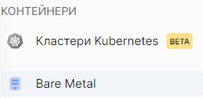
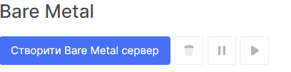
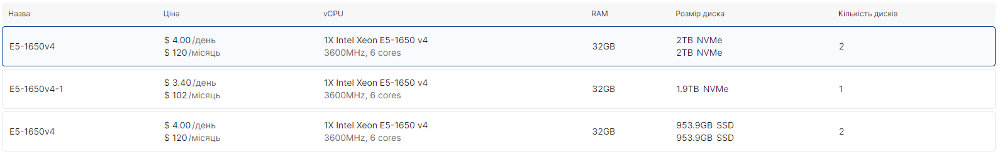

# Створити Bare Metal сервер

1. Перейдіть до розділу **Bare Metal**.

2. Натисніть на **Створити Bare Metal сервер**.

 
 
 
 
 

## Налаштувати Bare Metal сервер

1. Введіть назву майбутнього Bare Metal сервера в поле **Назва сервера**.

2. Виберіть сервер зі списку вільних серверів у таблиці під попереднім полем.

3. Виберіть макет диска для сервера зі списку в полі **Операційна система**.

4. Виберіть компонувальну схему диска для сервера зі списку в полі **Компонування диска**. Доступні макети дисків залежать від кількості дисків на сервері.

5. Встановіть root пароль у поле **Пароль root**.

6. Встановіть теги в поле **Теги**. Використовуйте пробіл для завершення введення тегу.

7. Переконайтеся, що ви заповнили всі необхідні поля, потім натисніть **Продовжити**.

 
 
 
 
 

## Налаштування мережі

1. Ви можете вибрати, створити або додати SSH ключ.

2. Переконайтеся, що ви вибрали потрібний SSH ключ, якщо хочете додати SSH ключ, потім натисніть **Продовжити**.

 
 
 
 
 

## Повна інформація створення

1. На цій сторінці відображається вся інформація про ваш вибір під час створення Bare Metal сервера.

2. Переконайтеся, що ви заповнили всі необхідні поля, потім натисніть **Створити**.

