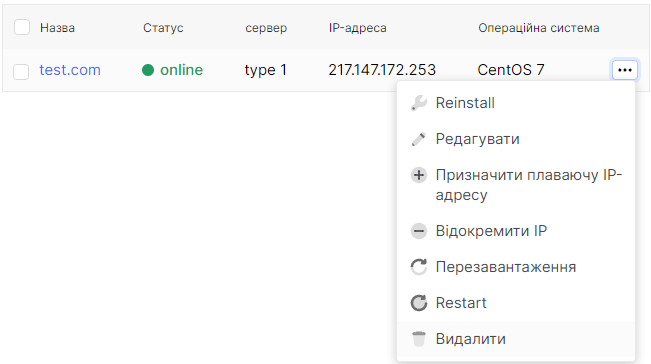
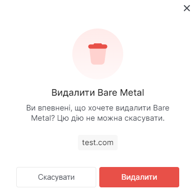

# Видалити Bare Metal сервер

1. Перейдіть до розділу **Bare Metal**.

2. Виберіть потрібний сервер, натисніть на три крапки в полі сервера та виберіть **Видалити** у контекстному меню.

3. У вікні видалення натисніть **Видалити**.

