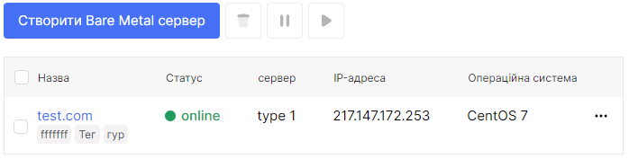

# Reinstall

1. Перейдіть до розділу **Bare Metal**.

2. Виберіть потрібний сервер, натисніть на три крапки в полі сервера та виберіть **Reinstall** у контекстному меню.

3. Виберіть ОС для сервера зі списку в полі під назвою **Операційна система**.

4. Виберіть компонувальну схему для сервера зі списку в полі під назвою **Компонування диска**. Доступні макети дисків залежать від кількості дисків на сервері.

5. Ви також можете вибрати SSH ключ.

6. Після внесення всіх необхідних змін натисніть **Перебудувати**.

 
 
 
 
 

## Редагування

1. Перейдіть до розділу **Bare Metal**.

2. Виберіть потрібний сервер, натисніть на три крапки в полі сервера та виберіть **Редагувати** у контекстному меню.

3. Ви можете змінити ім'я сервера в полі **Назва**.

4. Ви можете додати або видалити тег у полі **Теги**.

5. Натисніть **Перейменувати** після внесення всіх необхідних змін.

 
 
 
 
 

## Перезавантаження

1. Перейдіть до розділу **Bare Metal**.

2. Виберіть потрібний сервер, натисніть на три крапки в полі сервера та виберіть **Перезавантаження** у контекстному меню.

3. Натисніть **Так**, якщо хочете перезавантажити сервер.

 
 
 
 
 

## Restart

1. Перейдіть до розділу **Bare Metal**.

2. Виберіть потрібний сервер, натисніть на три крапки в полі сервера та виберіть **Restart** у контекстному меню.

3. Натисніть **Так**, якщо хочете скинути сервер.

 
 
 
 
 

## Зупинити

1. Перейдіть до розділу **Bare Metal**.

2. Виберіть потрібний сервер і натисніть на його ім'я.

3. На сторінці деталей сервера у верхньому правому куті є кнопка **Живлення**.

4. Натисніть кнопку **Живлення**.

5. Натисніть **Так** для зупинки сервера.

 
 
 
 
 

## Запустити

1. Перейдіть до розділу **Bare Metal**.

2. Виберіть потрібний сервер і натисніть на його ім'я.

3. На сторінці деталей сервера у верхньому правому куті є кнопка **Живлення**.

4. Натисніть кнопку **Живлення**.

5. Натисніть **Так** для запуску сервера.

 
 
 
 
 

## Редагувати сервер на сторінці деталей

1. Перейдіть до розділу **Bare Metal**.

2. Виберіть потрібний сервер і натисніть на його ім'я.

3. Ви можете виконати всі ці дії на сторінці деталей сервера, натиснувши на три крапки з назвою **Меню** у верхньому правому куті.

