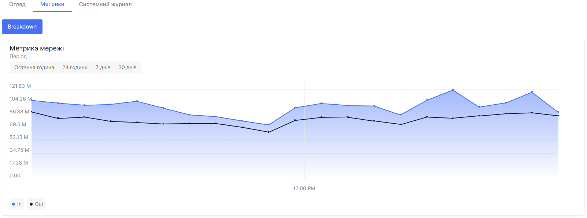

## Метрики Bare Metal сервера

1. Перейдіть до розділу **Bare Metal**.

2. Виберіть потрібний сервер і натисніть на його ім'я.

3. На цій сторінці відображається детальна інформація про сервер.

4. Виберіть вкладку **Метрики**.

5. На графіку відображаються **Метрики Мережі** за 24 години, 14 днів, 30 днів, остання година. 

6. Ви можете отримати комбіновані щомісячні дані у розділі **Breakdown**.

