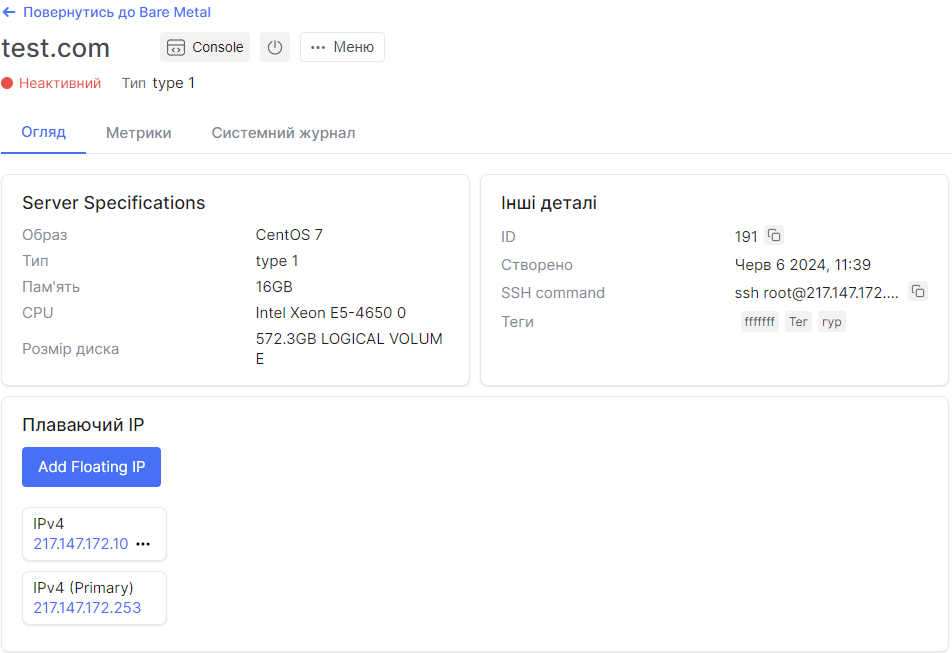

# Консоль

1. Перейдіть до розділу **Bare Metal**.

2. Виберіть потрібний сервер і натисніть на його ім'я.

3. На сторінці деталей сервера у верхньому правому куті є кнопка **Console**.

4. Натисніть **Console** і дочекайтеся перенаправлення на веб-вкладку консолі.

