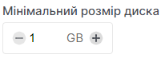

# Стандартне створення образу

import Tabs from '@theme/Tabs';
import TabItem from '@theme/TabItem';

<Tabs>
   <TabItem value="personal-area" label="Особистий кабінет" default>

1. Перейдіть до підрозділу **Образи**.


2. Натисніть на **Створити образ**.


3. Введіть назву майбутнього образу у поле під назвою **Ім'я образу**.


4. Виберіть формат майбутнього образу у списку поля **Формат образу**.


5. Виберіть тип джерела для створення образу.

    5.1. Створення образу з вказанням джерела по URL.

    
    
    5.2. Створення образу з завантаженням файлу диска.
    
    

6. (Додатково) Є можливість більш детально кастимізувати образ. Натисність на **Додаткові налаштування**.


7. Оберіть операційну систему, яка буде у майбутньому відібражатися напроти образа, у полі **Операційна система**.


8. Також є можливість ввести версію, яка буде у майбутньому відібражатися напроти образа, у полі **OS версія**.


9. Вкажіть мінімальний розмір диска.



10. Вкажіть мінімальний розмір RAM.


   </TabItem>
   <TabItem value="openstack" label="Openstack CLI">

   Переконайтеся, що клієнт OpenStack [встановлений](#) і ви можете [авторизуватись](#) для його використання.
   Виконайте потрібні команди.

   ```
   openstack image create
   --disk-format <disk-format> /
   --min-disk <disk-gb> /
   --min-ram <ram-mb> /
   --file <file> | --volume <volume>
   <image-name>
   ```

   `--disk-format <disk-format>` - Формат образу. Формати, що підтримуються: ami, ari, aki, vhd, vmdk, raw, qcow2, vdi, iso Формат за замовчуванням - raw.

   `--min-disk <disk-gb>` - Мінімальний обсяг диска, необхідний для завантаження образу, в гігабайтах.

   `--min-ram <ram-mb>` - Мінімальний обсяг оперативної пам'яті (RAM), необхідний для завантаження образу, в мегабайтах.

   `--file <file>` - Завантажити образ з локального файлу.

   </TabItem>
</Tabs>

# Створення образу через **диск**

<Tabs>
<TabItem value="personal-area" label="Особистий кабінет" default>

1. Перейдіть до підрозділу Диски.


2. Оберіть необхідний диск, нажміть на трьокрапку у полі диску,та у контекстному меню виберіть **Завантажити в образ**.


3. Вкажіть назву образу у полі **Назва**.


4. Оберіть формат образу у полі **Формат образу**.


5. Після заповнення данних натисніть **Завантажити**.


</TabItem>
 <TabItem value="openstack" label="Openstack CLI">

Переконайтеся, що клієнт OpenStack [встановлений](#) і ви можете [авторизуватись](#) для його використання.
Виконайте потрібні команди.
   
```
openstack image create --disk-format <disk-format> --volume <volume> <image-name>
```

`--disk-format <disk-format>` - Формат диска образ. Підтримувані опції включають: ami, ari, aki, vhd, vmdk, raw, qcow2, vdi, iso Формат за замовчуванням - raw.

`--volume <volume>` - Створити образ з диску.

</TabItem>
</Tabs>


# Створення образу шляхом дублювання вже існуючого.

1. Оберіть необхідний образ, нажміть на трьокрапку у полі образу,та у контекстному меню виберіть **Дублювати**.


2. Вкажіть назву майбутнього образу у полі **Назва**


3. (Додатково) Натисніть на чекбокс з описом: **Видалити вихідний образ...** для реалізації переміщення образу.


