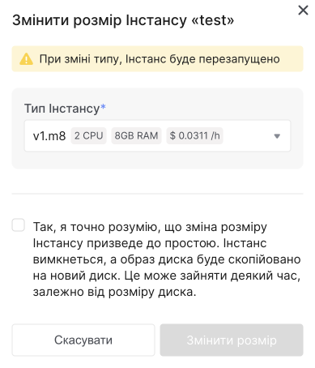

# Зміна типу інстансу

<Tabs>
  <TabItem value="personal-area" label="Особистий кабінет" default>

На платформі OneCloudPlanet ви можете змінити тип інстансу - кількість процесорів (vCPU) і обсяг оперативної пам'яті (RAM).

> :warning: **Коли ви зміните тип інстансу, інстанс буде перезавантажено.**

Перейдіть до **Інстансів**.


2. Змініть тип інстансу одним із наведених нижче способів.

**Через контекстне меню:**

- У списку інстансів знайдіть потрібний інстанс.

- Розгорніть контекстне меню інстансу.

- Виберіть дію **Змінити розмір**.

- Виберіть тип інстансу, до якого потрібно перейти, і натисніть **Змінити розмір**.

**На сторінці інстансу:**

- У списку інстансів клацніть назву інстансу, ім'я якого потрібно змінити.

- Праворуч над таблицею з параметрами інстансу натисніть на іконку потрібної дії, щоб розгорнути великі можливі дії, натисніть кнопку **Меню**.

- Виберіть дію **Змінити розмір**.



- Заповніть поле введення та натисніть **Змінити розмір**.

</TabItem>

<TabItem value="openstack" label="Openstack CLI">

Переконайтеся, що клієнт OpenStack [встановлений](#) і ви можете [авторизуватись](#) для його використання.

Виконайте потрібну команду.

- Змінити тип інстансу

Отримайте список доступних типів та скопіюйте ID типу:
```
openstack flavor list --all
```

Запустіть зміну типу інстансу та дочекайтеся закінчення процесу:
```
openstack server resize --flavor <ID типу><ID інстансу>
```

</TabItem> 
</Tabs>