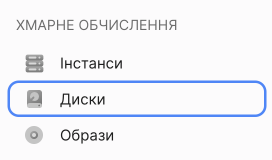

# Створення диску

Мережевий диск можна створити разом з інстансом або створити окремо, а потім підключити до інстансу.

Локальний диск створюється лише разом із інстансом.

Мережевий диск можна створити з різних джерел:

- Порожній - спочатку такий диск не містить даних. Ви можете використовувати його для масштабування дискового простору в інстансі;
- з образу – підготовленого OneCloudPlanet або вашого власного завантаженого образу. Можна використовувати для заміни завантажувального диска під час відновлення інстансу або для клонування інстансу;
- з іншого диска, снапшота чи бекапу – створити копію диска.

Вартість мережного диска залежить від [типу диска](#). Розрахувати вартість можна під час створення інстансу.

import Tabs from '@theme/Tabs';
import TabItem from '@theme/TabItem';

<Tabs>
 <TabItem value="personal-area" label="Особистий кабінет" default>

1. Перейдіть до **Диски**.



2. Нажміть **Створити диск**.


3. Введіть ім'я диску.


4. Виберіть джерело диска (готовий образ, власний образ, диск, снапшот або бекап). Якщо потрібно створити порожній диск, пропустіть цей крок.


5. Виберіть [тип диска](#). Диски відрізняються швидкістю читання/запису та значеннями пропускної спроможності.


6. Вкажіть розмір диска у ГБ. Розмір диска, створеного з джерела, повинен дорівнювати або більше розміру джерела. Ми рекомендуємо не перевищувати обмеження на максимальний розмір дисків. Після створення диска не можна буде зменшити безпосередньо.


7. Нажміть **Створити**.


</TabItem>

<TabItem value="openstack" label="Openstack CLI">

Переконайтеся, що клієнт OpenStack [встановлений](#) і ви можете [авторизуватись](#) для його використання.

Виконайте потрібну команду.

Створіть мережевий диск:

```
    openstack volume create
    [--image <image> | --snapshot <snapshot> | --source <volume>] \
    --size <size> \
    --type <volume_type> \
    [--availability-zone <new_zone>] \
    <volume_name>
```
Вкажіть:
    тип джерела:
- `--image <image>` - для создания диска из образа. Параметр `<image>` - имя или ID образа, список можно посмотреть с помощью `openstack image list`
- `--snapshot <snapshot>` - для создания диска из снапшота. Параметр `<snapshot>` - имя или ID снапшота, список можно посмотреть с помощью `openstack volume snapshot list`
- `--source <volume>` - для создания диска из другого диска. Параметр `<volume>` - имя или ID диска, список можно посмотреть с помощью `openstack volume snapshot list`

- `--size <size>` - розмір диска у ГБ. Для дисків із джерела мінімальний розмір повинен дорівнювати розміру джерела. Враховуйте [обмеження дисків](/ua/control-panel/cloud-platform/compute/volumes/volume-type#ліміти) на максимальний розмір;
- `--type <volume_type>` - тип диска. Типі дисков отличаются значениями пропускной способности и скорости чтения/записи. Список доступных типов можно посмотреть с помощью `openstack volume type list`
- `--<volume_type>` - ім'я диску.


</TabItem> 
</Tabs>