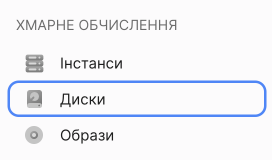
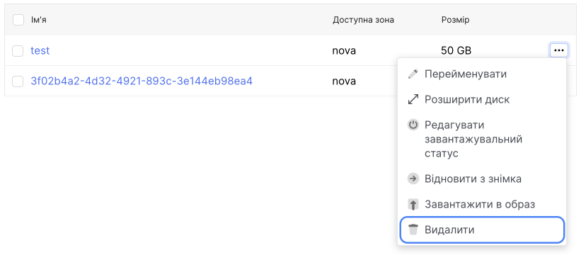

# Видалення диску

[Локальний диск](/ua/control-panel/cloud-platform/compute/volumes/local-storage) можна видалити лише разом із сервером, до якого він підключений.

[Мережеві диски](/ua/control-panel/cloud-platform/compute/volumes/volume-type) можна видалити разом із інстансом або відключити від інстансу та видалити окремо.

> **⚠** Якщо видалити диск, дані не можна буде відновити. Ми рекомендуємо зробити копію даних перед видаленням диска – створіть образ диска або створіть інший диск із цього диска. Снапшоти диска видаляться разом із диском.

**Якщо диск, який ви хочете видалити, є другим в інстансі або не прикріплений до нього:**

1. Перейдіть до **Диски**.

**Через контекстне меню:**

- У списку мережевих дисків знайдіть потрібний диск.

- Розгорніть контекстне меню диску.

- Виберіть дію **Видалити**.

**Якщо диск, який ви хочете видалити, є мережним завантажувальним диском:**

Видалення завантажувального мережного диска, можливе лише [видаленням інстансу](/ua/control-panel/cloud-platform/compute/instances/delete-instance) з яким пов'язаний цей диск.