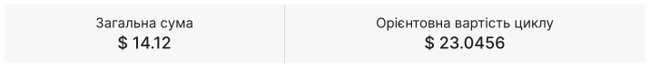

# Оплата

Хмарна платформа OneCloudPlanet використовує платіжну модель оплати за використання: ви платите за створені вами [ресурси](#), навіть якщо вони вимкнені. Кошти списуються з [балансу](/ua/control-panel/cloud-platform/general-information/payment#баланс) за кожен період часу - за попередній час оренди ресурсів. Зовнішній трафік теж платний.

Ціни на ресурси можна знайти на [веб-сайті](https://onecloudplanet.com/).

## Баланс

Баланс хмарної платформи використовується для оплати ресурсів хмарної платформи.

Якщо протягом 14 днів баланс буде нульовим, усі об’єкти хмарної платформи будуть автоматично видалені.

Якщо баланс стає негативним, усі послуги автоматично відключаються. Працездатність буде заморожена до погашення заборгованості, а витрати на ресурси будуть накопичуватися до тих пір, поки ви не відключите послуги. Для відновлення роботи необхідно [поповнити баланс](#) на суму боргу.

Ви можете [налаштувати сповіщення про баланс](#).

## Переглянути споживання

На панелі керування перейдіть до **Платежі ⟶ Історія платежів**.

Ви можете побачити вартість конкретного хмарного ресурсу та загальну вартість за місяць, а також орієнтовну вартість циклу.

Дані про витрати оновлюються щогодини.

Щоб дізнатися вартість конкретного хмарного ресурсу, відкрийте вкладку ресурс - відобразіть споживання ресурсу та вартість за цей період.

