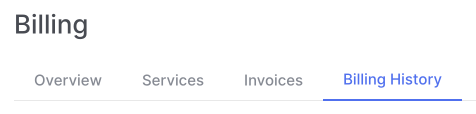
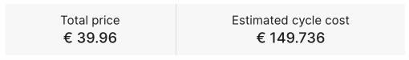
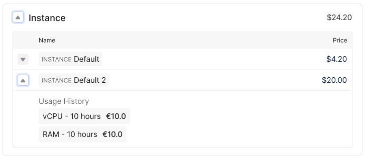

# Cloud Instance Payment

## Payment Model

The OneCloudPlanet cloud platform uses a pay-as-you-go payment model - you pay for the [compute resources](#) you create, even if they are turned off. Funds are debited from the [balance](#) for each period of time - for the previous time of renting resources. External traffic is also paid.

Prices for resources can be found on the [website](#).

More details in the [Terms of Service](#).

## Balance

The cloud platform balance is used to pay for cloud platform resources.

If the balance is zero within 14 days, all objects of the cloud platform will be automatically deleted.

If the balance becomes negative, all services will be automatically disabled. The ability to work will be frozen until the debt is paid off, and resource charges will accrue until you turn off the services. To restore work, you need to [replenish the balance](#) by the amount of the debt.

You can [set up balance notifications](#).

## View consumption

In the control panel, go to **Billing ⟶ Billing History**.

You can see the cost of a specific cloud resource and the total cost per month, as well as the estimated cost of the cycle.

Cost data is updated every hour.

To find out the cost of a specific cloud resource, open the resource tab - display resource consumption and cost for this period.

