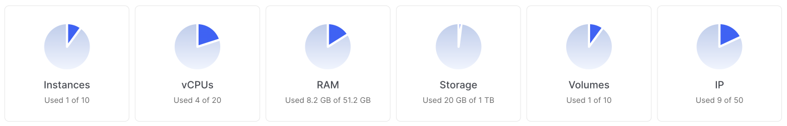

# Quotas

When you create an account, quotas are allocated by default for each resource. To increase the quota limit, please contact technical support.

When the amount of the resource reaches the quota value, the resource will stop being created.

Unused quotas are not paid - you only pay for the resources you use. For example, if the quota limit is ten public IP addresses, but three IP addresses have been created, only three addresses will be paid.

## Change quota limits

The quota value for each resource can be increased or decreased. To change the quotas in your account, contact technical support.

Create a ticket with the subject **Increase quotas** and specify which cloud resource you need to change.