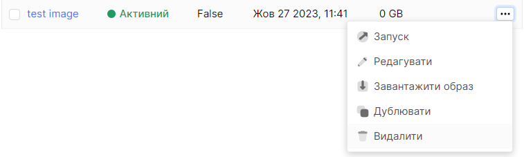
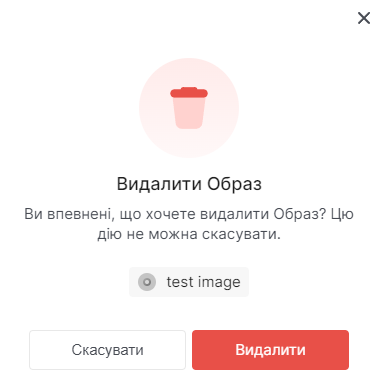

# Видалення образу

import Tabs from '@theme/Tabs';
import TabItem from '@theme/TabItem';

<Tabs>
  <TabItem value="personal-area" label="Особистий кабінет" default>

1. Оберіть необхідний образ, нажміть на трьокрапку у полі образу,та у контекстному меню виберіть **Видалити**.



2. Натисніть на кнопку **Видалити**.



</TabItem>
<TabItem value="openstack" label="Openstack CLI">

Переконайтеся, що клієнт OpenStack встановлений і ви можете авторизуватись для його використання.
Виконайте потрібні команди.

```
openstack image delete <image-name>
```

</TabItem>
</Tabs>
