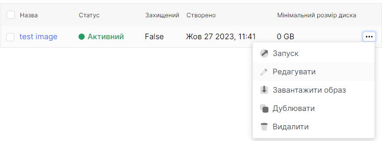
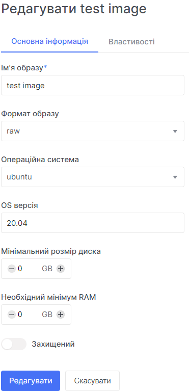
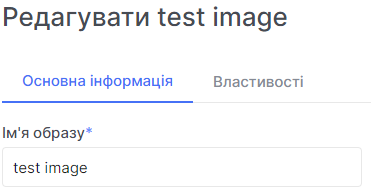
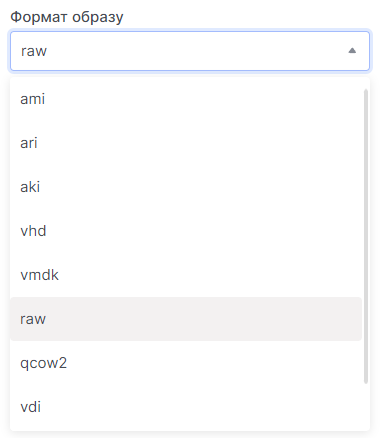
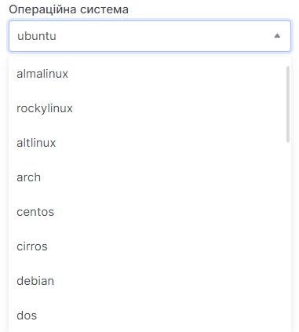
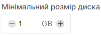
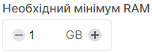
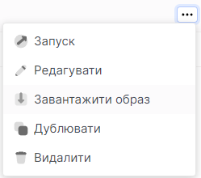

# Редагування образу

import Tabs from '@theme/Tabs';
import TabItem from '@theme/TabItem';

<Tabs>
  <TabItem value="personal-area" label="personal area" default>

1. Оберіть необхідний образ, нажміть на трьокрапку у полі образу,та у контекстному меню виберіть **Редагувати**.



2. У розділі **Основна інформація** є можливість редагувати основні дані.

    

    2.1. Введіть нове ім'я у поле **Ім'я образу** для його редагування.

    
 
    2.2. Виберіть інший формат образу, у полі **Формат образу** для його редагування.

    

    2.3. Виберіть іншу версію операційної системи у полі **OS версія**.

    

    2.4. Виберіть мінімальний розмір диска.

    

    2.5. Виберіть мінімальний розмір оперативної пам'яті.

    

    2.6. Ви можете захистити свій образ від видалення активувавши поле **Захищенний**.

    

    2.7. Натисніть **Редагувати**.

    

</TabItem>
<TabItem value="openstack" label="Openstack CLI">

Переконайтеся, що клієнт OpenStack встановлений і ви можете авторизуватись для його використання.
Виконайте потрібні команди.

```
openstack image set --name <name>
                    --min-disk <disk-gb> /
                    --min-ram <ram-mb> /
                    --disk-format <disk-format> /
                    --os-distro <os-distro> /
                    --os-version <os-version> /
                    --protected /
                    <image-name>
```

`--name <name>` - Нове ім'я образу

`--disk-format <disk-format>` - Формат образу. Формати, що підтримуються: ami, ari, aki, vhd, vmdk, raw, qcow2, vdi, iso Формат за замовчуванням - raw.

`--min-disk <disk-gb>` - Мінімальний обсяг диска, необхідний для завантаження образу, в гігабайтах.

`--min-ram <ram-mb>` - Мінімальний обсяг оперативної пам'яті (RAM), необхідний для завантаження образу, в мегабайтах.

`--os-distro <os-distro>` - Название дистрибутива операционной системы.

`--os-version <os-version>` - Версия дистрибутива операционной системы.

`--protected` - Заборонити видалення образу.

</TabItem>
</Tabs>