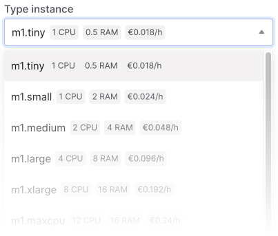

# Конфігурації

Під час [створення інстансу](/control-panel/cloud-platform/instances/create-an-instance) ви можете вибрати необхідну кількість ядер процесора (vCPU), оперативну пам’ять (RAM) і вибрати local або block сховище.

Стаціонарна конфігурація доступна з декількох ліній в різних місцях, які відрізняються співвідношенням ресурсів і технічними характеристиками.

Після створення інстансу ви можете [змінити конфігурацію](/control-panel/cloud-platform/instances/management-instance).

## Performance and Availability

| Location       | Availability zone | Processor (vCPU)                             | Memory (RAM)           |
|----------------|-------------------|----------------------------------------------|------------------------|
| Ukraine        | UA1               | Intel® Xeon® Processor E5-2680 v4 @ 2.40 ГГц | DDR4 REG 2133–2933 МГц |
| Poland         | PL1               | Intel® Xeon® Gold 6154 @ 3.00 ГГц            | DDR4 REG 3200 МГц      |

## View list of configurations

A list of all available configurations can be viewed in the control panel when creating a server.

| Location       | Availability zone | Processor (vCPU)                             | Memory (RAM)           |
|----------------|-------------------|----------------------------------------------|------------------------|
| Ukraine        | UA1               | Intel® Xeon® Processor E5-2680 v4 @ 2.40 ГГц | DDR4 REG 2133–2933 МГц |
| Poland         | PL1               | Intel® Xeon® Gold 6154 @ 3.00 ГГц            | DDR4 REG 3200 МГц      |
