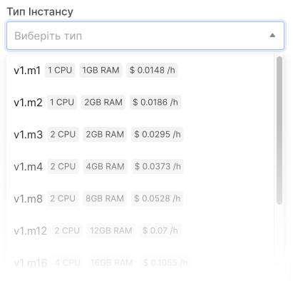

# Створення Інстансу

Баланс облікового запису має бути позитивним, а [квот](#) має бути достатнім для створення бажаної конфігурації Інстансу.

## Доступні ОС

Команда OneCloudPlanet підготувала образи деяких ОС. Список готових образів доступний у вашому обліковому записі у вікні створення нового Інстансу.

При необхідності ви можете самостійно імпортувати образ ОС.

## Створення Інстансу

### 1. Налаштування Інстансу

1. Перейдіть до **Інстансів**.

2. Натисніть **Створити Інстанс**.

3. Введіть назву Інстансу. Його буде встановлено як ім’я хоста в операційній системі на сервері. Використовуйте лише латинські літери, цифри або символи `-`, `_` і `.`.

4. Створіть пароль для користувача `root` (користувача з необмеженими правами на всі дії в системі) для підключення до сервера.

5. Виберіть попередньо встановлену конфігурацію Інстансу (CPU та RAM). Докладніше в огляді [конфігурацій](#).

6. Виберіть версію операційної системи або створений раніше образ.

7. Виберіть завантажувальний (системний) диск сервера:

- **Local Storage** - розмір диска залежатиме від конфігурації. Сервер з локальним диском можна створити тільки з готового або нестандартного образу.

- **Volume** - У полі Тип диска виберіть тип диска та вкажіть його розмір.

Після створення сервера можна замінити лише мережевий завантажувальний диск.

8. Виберіть кількість Інстансів для створення.

9. Нажміть **Продовжити**.

### 2. Налаштування мережі

10. Виберіть існуючу мережу або створіть нову. Коли ви вибираєте **Створити нову мережу**, мережа та підмережа в ній створюються автоматично.

11. Ключ Інстанса: виберіть ключ для підключення через SSH або створіть новий.

12. Якщо ви виберете **Створити новий ключ**, після його створення вам потрібно вибрати його в списку ключів SSH. Щоб він з’явився, натисніть кнопку **Оновити список**.

13. Нажміть **Продовжити**.

14. На останньому етапі перевірте налаштування Інстансу та Мережі.

14. Нажміть **Створити**.

