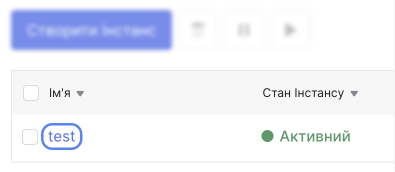

# Діагностіка інстансу

У надзвичайних ситуаціях і коли немає мережевого підключення до інстансу, використовуйте [консоль VNC](/ua/control-panel/cloud-platform/instances/diagnostics-instance#vnc-консоль).

## VNC консоль

VNC Консоль — це інструмент для діагностики та керування інстансу, який працює у браузері. 
Використовуйте консоль VNC, якщо:

- інстанс не має зовнішньої IP-адреси або не підключений до Інтернету;
- Рекомендовані способи підключення до інстансу (через SSH або RDP) не працюють.
- встановлення пароля root для екземпляра в ОС Windows.

Доступ до консолі VNC з'являється відразу після запуску інстансу. Це дозволяє виявляти збої під час завантаження операційної системи.

Особливості роботи з консоллю VNC:

- для введення тексту можна використовувати тільки латинський алфавіт;
- буфер обміну в консолі VNC недоступний, ви не можете копіювати та вставляти текст.

1. Перейдіть до **Інстансів**.

2. У списку інстансів клацніть на імені потрібного інстансу.

3. На сторінці інстансу перейдіть на вкладку **Консоль**.

