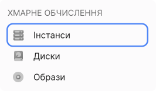
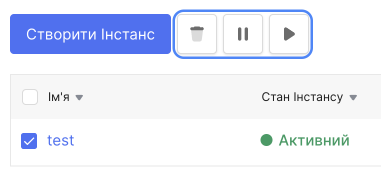
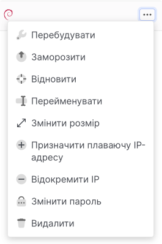
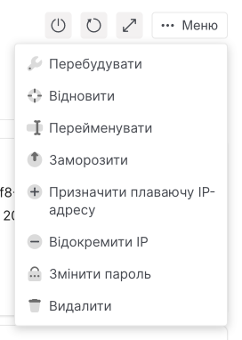
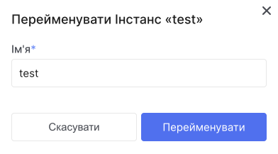
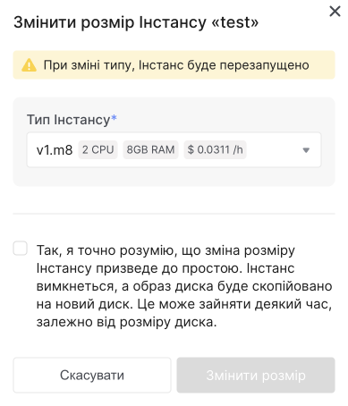

# Управління інстансу

Ви можете змінити налаштування та статус екземпляра платформи OneCloudPlanet у своєму обліковому записі або через OpenStack CLI.

## Запуск, зупинка, перезавантаження інстанс

import Tabs from '@theme/Tabs';
import TabItem from '@theme/TabItem';

<Tabs>
  <TabItem value="personal-area" label="Особистий кабінет" default>

1. Перейдіть до **Інстансів**.



2. Змініть стан інстанса одним із наведених нижче способів.

**Використання групових операцій - для кількох інстансів:**

- Зі списку виберіть інстанси, стан яких потрібно змінити.



- Над списком інстансів натисніть кнопку з потрібною дією. Дія відбудеться автоматично.

**Через контекстне меню - для одного інстансу:**

- У списку знайдіть інстанс, стан якого потрібно змінити.

- Розгорніть контекстне меню інстансу.



- Виберіть потрібну дію.

**На сторінці інстансу:**

- У списку клацніть назву інстансу, стан якого потрібно змінити.

- Праворуч над таблицею з параметрами інстансу натисніть на іконку потрібної дії, щоб розгорнути великі можливі дії, натисніть кнопку **Меню**.

  

  </TabItem>

  <TabItem value="openstack" label="Openstack CLI">
    
Переконайтеся, що клієнт OpenStack [встановлений](#) і ви можете [авторизуватись](#) для його використання.

Виконайте потрібну команду.

- Запустити інстанс
```
openstack server start <ID інстансу>
```

- Зупинка інстансу
```
openstack server stop <ID інстансу>
```

- Перезавантаження інстансу
```
openstack server reboot <ID інстансу>
```

  </TabItem>
</Tabs>

## Видалити інстанс

<Tabs>
  <TabItem value="personal-area" label="Особистий кабінет" default>

На платформі OneCloudPlanet інстанс видаляється за замовчуванням разом із основним диском (кореневим диском).

> :warning: **Операція видалення незворотна! Збережіть необхідні дані перед видаленням інстансу.**

1. Підготуйте інстанс до видалення. Продублюйте диски від інстансу, який потрібно зберегти.

2. Після збереження необхідних даних видаліть інстанс.

3. Видаліть інстанс одним із наведених нижче методів.

**Щоб видалити інстанс через особистий кабінет, необхідно:**

1. Перейдіть до **Інстансів**.


2. Видаліть інстанс одним із наведених нижче методів.

**Використання групових операцій - для кількох інстансів:**

- Зі списку виберіть інстанси, стан яких потрібно видалити.


- Над списком інстансів натисніть кнопку **Видалити**. Дія відбудеться автоматично.

**Через контекстне меню - для одного інстансу:**

- У списку інстансів натисніть на ім'я інстансу, яку потрібно видалити.

- Розгорніть контекстне меню інстансу.


- Нажміть на **Видалити**

**На сторінці інстансу:**

- У списку інстансів натисніть на ім'я інстансу, яку потрібно видалити.

- Праворуч над таблицею з параметрами інстансу натисніть кнопку **Меню**.



- Нажміть на **Видалити**.

</TabItem>

<TabItem value="openstack" label="Openstack CLI">

Переконайтеся, що клієнт OpenStack [встановлений](#) і ви можете [авторизуватись](#) для його використання.

Виконайте потрібну команду.

- Запустити інстанс
```
openstack server delete <ID інстансу>
```

</TabItem> 
</Tabs>

## Перейменувати інстанс

<Tabs>
  <TabItem value="personal-area" label="Особистий кабінет" default>

На платформі OneCloudPlanet ви можете перейменувати інстанс.

1. Перейдіть до **Інстансів**.

2. Змініть назву інстансу одним із наведених нижче способів.

**Через контекстне меню:**

- У списку інстансів знайдіть потрібний інстанс.

- Розгорніть контекстне меню інстансу.


- Виберіть дію **Перейменувати**.

- Заповніть поле введення та натисніть кнопку **Перейменувати**.



**На сторінці інстансу:**

- У списку інстансів клацніть назву інстансу, ім'я якого потрібно змінити.

- Праворуч над таблицею з параметрами інстансу натисніть на іконку потрібної дії, щоб розгорнути великі можливі дії, натисніть кнопку **Меню**.


- Виберіть дію **Перейменувати**.

- Заповніть поле введення та натисніть **Перейменувати**.


</TabItem>

<TabItem value="openstack" label="Openstack CLI">

Переконайтеся, що клієнт OpenStack [встановлений](#) і ви можете [авторизуватись](#) для його використання.

Виконайте потрібну команду.

- Перейменувати інстанс
```
openstack server set --name <нове ім'я><ID інстансу>
```

</TabItem> 
</Tabs>

## Змінити тип інстансу

<Tabs>
  <TabItem value="personal-area" label="Особистий кабінет" default>

На платформі OneCloudPlanet ви можете змінити тип інстансу - кількість процесорів (vCPU) і обсяг оперативної пам'яті (RAM).

> :warning: **Коли ви зміните тип інстансу, інстанс буде перезавантажено.**

Перейдіть до **Інстансів**.


2. Змініть тип інстансу одним із наведених нижче способів.

**Через контекстне меню:**

- У списку інстансів знайдіть потрібний інстанс.

- Розгорніть контекстне меню інстансу.

- Виберіть дію **Змінити розмір**.

- Виберіть тип інстансу, до якого потрібно перейти, і натисніть **Змінити розмір**.

**На сторінці інстансу:**

- У списку інстансів клацніть назву інстансу, ім'я якого потрібно змінити.

- Праворуч над таблицею з параметрами інстансу натисніть на іконку потрібної дії, щоб розгорнути великі можливі дії, натисніть кнопку **Меню**.

- Виберіть дію **Змінити розмір**.



- Заповніть поле введення та натисніть **Змінити розмір**.

</TabItem>

<TabItem value="openstack" label="Openstack CLI">

Переконайтеся, що клієнт OpenStack [встановлений](#) і ви можете [авторизуватись](#) для його використання.

Виконайте потрібну команду.

- Змінити тип інстансу

Отримайте список доступних типів та скопіюйте ID типу:
```
openstack flavor list --all
```

Запустіть зміну типу інстансу та дочекайтеся закінчення процесу:
```
openstack server resize --flavor <ID типу><ID інстансу>
```

</TabItem> 
</Tabs>