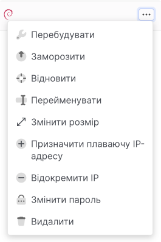

# Перейменування інстансу

<Tabs>
  <TabItem value="personal-area" label="Особистий кабінет" default>

На платформі OneCloudPlanet ви можете перейменувати інстанс.

1. Перейдіть до **Інстансів**.

2. Змініть назву інстансу одним із наведених нижче способів.

**Через контекстне меню:**

- У списку інстансів знайдіть потрібний інстанс.

- Розгорніть контекстне меню інстансу.



- Виберіть дію **Перейменувати**.

- Заповніть поле введення та натисніть кнопку **Перейменувати**.


**На сторінці інстансу:**

- У списку інстансів клацніть назву інстансу, ім'я якого потрібно змінити.

- Праворуч над таблицею з параметрами інстансу натисніть на іконку потрібної дії, щоб розгорнути великі можливі дії, натисніть кнопку **Меню**.


- Виберіть дію **Перейменувати**.

- Заповніть поле введення та натисніть **Перейменувати**.


</TabItem>

<TabItem value="openstack" label="Openstack CLI">

Переконайтеся, що клієнт OpenStack [встановлений](#) і ви можете [авторизуватись](#) для його використання.

Виконайте потрібну команду.

- Перейменувати інстанс
```
openstack server set --name <нове ім'я><ID інстансу>
```

</TabItem> 
</Tabs>