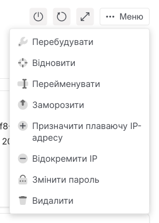

# Запуск, зупинка, перезавантаження інстансу

import Tabs from '@theme/Tabs';
import TabItem from '@theme/TabItem';

<Tabs>
  <TabItem value="personal-area" label="Особистий кабінет" default>

1. Перейдіть до **Інстансів**.


2. Змініть стан інстанса одним із наведених нижче способів.

**Використання групових операцій - для кількох інстансів:**

- Зі списку виберіть інстанси, стан яких потрібно змінити.


- Над списком інстансів натисніть кнопку з потрібною дією. Дія відбудеться автоматично.

**Через контекстне меню - для одного інстансу:**

- У списку знайдіть інстанс, стан якого потрібно змінити.

- Розгорніть контекстне меню інстансу.


- Виберіть потрібну дію.

**На сторінці інстансу:**

- У списку клацніть назву інстансу, стан якого потрібно змінити.

- Праворуч над таблицею з параметрами інстансу натисніть на іконку потрібної дії, щоб розгорнути великі можливі дії, натисніть кнопку **Меню**.

  

  </TabItem>

  <TabItem value="openstack" label="Openstack CLI">
    
Переконайтеся, що клієнт OpenStack [встановлений](#) і ви можете [авторизуватись](#) для його використання.

Виконайте потрібну команду.

- Запустити інстанс
```
openstack server start <ID інстансу>
```

- Зупинка інстансу
```
openstack server stop <ID інстансу>
```

- Перезавантаження інстансу
```
openstack server reboot <ID інстансу>
```

  </TabItem>
</Tabs>