# Створення мережі

Для того чтобы удалить сеть, нужно изначально удалить привязанности к интерфейсам в маршутизаторах, маршутизаторы, порты в сетях и только потом сеть.

1. Перейдіть до **Мережі**.

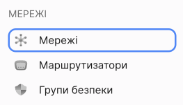

Буде відображено список мереж. Запам'ятайте назву мережі, яку потрібно видалити.

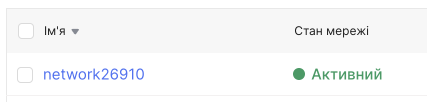

2. Перейдіть до **Маршутизатори**.

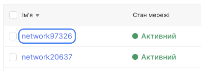

У списку натисніть назву маршутизатора, який прикріплений до мережі.

Відкриється сторінка з детальною інформацією про маршутизатор. У тому числі буде відображена мережа до якого прикріплений маршутизатор. 

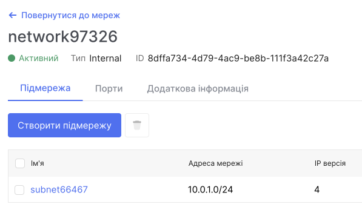

## Створення мережі

1. Перейдіть до **Мережі**.

2. Нажміть **Створити мережу**.

3. Введіть ім'я мережі.

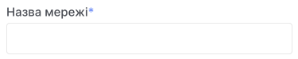

4. (опціонально) Дайте доступ до Інтернету. Це необхідно, якщо ви плануєте скористатися сервісами VPN, SNAT.

5. Виберіть із запропонованого списку маршрутизатор.

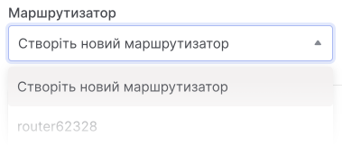

6. За замовчуванням підмережа вже створена, але ви можете додати її ще. Якщо потрібно додати підмережі пізніше, пропустіть цей крок.

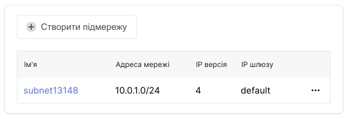

7. Натисніть **Створити**.

Після створення мережі вона з'явиться у загальному списку мереж.

## Редагування мережі

1. Перейдіть до **Мережі**.

**Через контекстне меню:**

- У списку мереж знайдіть потрібну мережу.

- Розгорніть контекстне меню мережи.

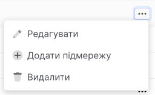

- Виберіть дію **Редагувати**.

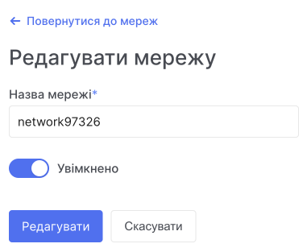

Ви можете змінити ім'я та стан мережі.

## Видалення мережі

> :warning: **Разом із мережею будуть видалені всі підмережі та порти.**

1. Перейдіть до **Мережі**.

**Через контекстне меню:**

- У списку мереж знайдіть потрібну мережу.

- Розгорніть контекстне меню мережи.

- Виберіть дію **Видалити**.

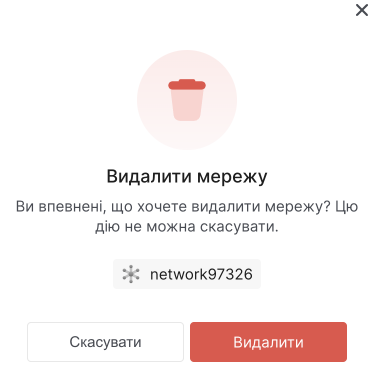

## Створення підмережі

> :warning: **Разом із мережею будуть видалені всі підмережі та порти.**

1. Перейдіть до **Мережі**.

**Через контекстне меню:**

- У списку мереж знайдіть потрібну мережу.

- Розгорніть контекстне меню мережи.

- Виберіть дію **Додати підмережу**.

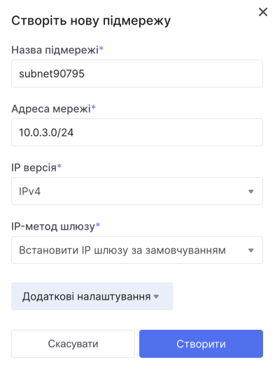

- Вкажіть назву підмережі.

- Введіть IP-адресу та шлюз підмережі.

- (опційно) За замовчуванням DHCP увімкнено. Адреси, видані DHCP-сервером, залишатимуться постійними. Вимкнення DHCP призведе до того, що IP-адреси, видані DHCP-сервісом, перестануть обслуговуватися. Це може призвести до відсутності віртуальних машин. Якщо потрібно, вимкніть його.