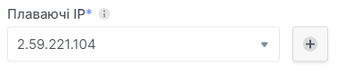

# Створення плаваючих IP

 

## Створення плаваючих IP у розділі **Плаваючі IP**.

1. Користуючись боковою панелью перейдіть до розділу **Плаваючі IP**.

2. Натисніть кнопку **Створити плаваючу IP-адресу**.

3. Підтвердіть створення плаваючої IP-адреси, після ознайомлення з ціновою політикою.

 

## Створення плаваючих IP у розділі **Інстанси**.
1. Користуючись боковою панелью перейдіть до розділу **Інстанси**.

2. Використайте трьохкрапку, у полі інстанса, для розвертання контекстного меню, для взаімодії з інстансом.
У контекстному меню оберіть розділ **Призначити плавуючу IP-адресу**.

4. Користучись сиволом "+" біля випадаючого поля, під назвою **Плаваючі IP**, створити нову плавуючу IP-адресу.

5. Дочекатися оповіщення про вдале створення плаваючої IP-адреси.

