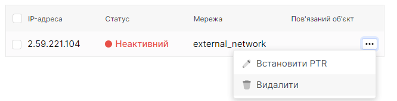

# Видалення плаваючих IP

 

## Перший спосіб видалення плаваючих IP.
1. Користуючись боковою панелью перейдіть до розділу **Плаваючі IP**.

2. У полі плавуючої IP-адреси натисніть на трьокрапку. У контекстному меню оберіть розділ **Видалити**.

4. У окні підтвердження натисність кнопку **Видалити**.

 

##  Другий, масовий, спосіб видалення плаваючих IP.
1. Користуючись боковою панелью перейдіть до розділу **Плаваючі IP**.

2. У полі плавуючої IP-адреси натисніть на чекбокс(перший натискаємий об'єкт у полі IP-адреси).

4. Використайте кпопку з зображення смітєвого баку поряд з кнопкою Створити плаваючу IP-адресу.

