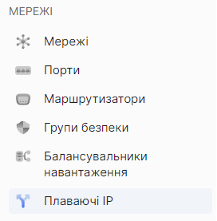
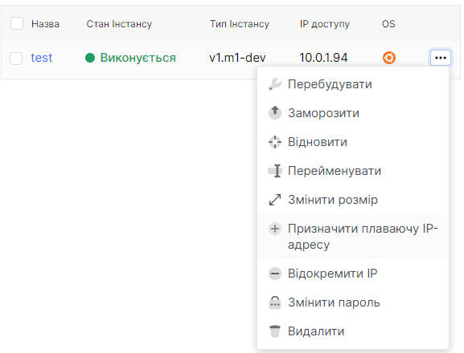
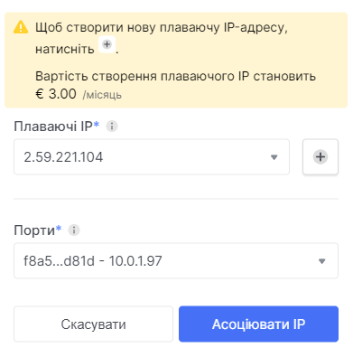
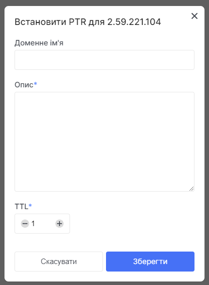

# Управління плаваючими IP

 

## Перегляд переліку плаваючих IP-адрес.
1. Користуючись боковою панелью перейдіть до розділу **Плаваючі IP**.

2. Буде відображенний перелік вже існуючих плаваючих API.

 

## Призначення плаваючої IP-адреси, без попереднього створення.
1. Користуючись боковою панелью перейдіть до розділу **Інстанси**.

2. Використайте трьохкрапку, у полі інстанса, для розвертання контекстного меню, для взаімодії з інстансом. 
У контекстному меню оберіть розділ **Призначити плавуючу IP-адресу**.

3. Користучись сиволом "**+**" біля випадаючого поля під назвою **Плаваючі IP** створити нову плавуючу IP-адресу.

4. Дочекатися оповіщення про вдале створення плаваючої IP-адреси.

5. У першому випадаючому списку, під назвою **Плаваючі IP**, виберіть необхідну плаваючу IP-адресу.
   У другому випадаючому списку, під назвою **Порти**, виберіть необхідний-доступний порт.

6.  Натисніть кнопку **Асоціювати IP**.

 

## Призначення плаваючої IP-адреси, з попереднього створення.
1. Користуючись боковою панелью перейдіть до розділу **Інстанси**.

2. Використайте трьохкрапку, у полі інстанса, для розвертання контекстного меню, для взаімодії з інстансом. 
У контекстному меню оберіть розділ **Призначити плавуючу IP-адресу**.

5. У першому випадаючому списку, під назвою **Плаваючі IP**, виберіть необхідну плаваючу IP-адресу.
   У другому випадаючому списку, під назвою **Порти**, виберіть необхідний-доступний порт.

6.  Натисніть кнопку **Асоціювати IP**.

 

## Відокремити плавуючу IP-адресу.
1. Користуючись боковою панелью перейдіть до розділу **Інстанси**.

2. Використайте трьохкрапку, у полі інстанса, для розвертання контекстного меню, для взаімодії з інстансом. 
 У контекстному меню оберіть розділ Відокремити плавуючу IP-адресу

 

## Встановлення PTR
1. Користуючись боковою панелью перейдіть до розділу **Плаваючі IP**.

2. У полі плавуючої IP-адреси натисніть на трьокрапку. У контекстному меню оберіть розділ **Встановити PTR**.

5. Встановіть доменне ім'я у відповідному полі.
6. Додайте додаткову інформацію в полі під назвою **Опис**.
7. Виберіть час життя у полі **TTL**.
8. Натисніть кнопку **Зберегти**.

