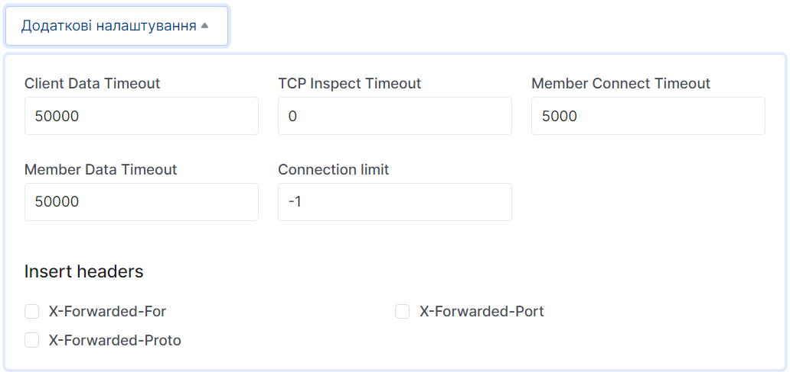

# Створення балансувальника навантаження

1. Перейдіть до підрозділу **Балансувальники навантаження**.

2.Натисніть на **Створити балансувальник навантаження**.

### Відомості про балансування навантаження

1. Введіть назву майбутнього балансувальника навантаження у полі **Назва балансувальника навантаження**.

2. Можете вказати IP адресу у полі **IP-адреса**.

3. Додайте опис балансувальника навантажень, при необхідності.

4. Також є можливість змінити статус активності("увімкнений" | "вимкнутий") балансувальник навантажень.

5. Переконайтесь, що заповнили всі необхідні поля - натисніть **Продовжити**

### Відомості про слухача

1. Введіть назву слухача у поле **Назва**.

2. Опишіть слухача, за необхідності.

3. Виберіть протокол для слуховування.

4. Введіть порт, який плануєте прослуховувати.

5. Також є можливість відредагувати додаткові налаштування натиснувши на **Додаткові налаштування** та змінити приведені дані на необхідні вам.

6. Переконайтесь, що заповнили всі необхідні поля - натисніть **Продовжити**

### Деталі пулу

1. Введіть назву пулу.

2. За необзідності додайте опис вашого пулу.

3. Оберіть алгоритм за яким буде розподілятись навантаження.

4. Доповніть данні для налаштування розподілу навантаження у полі **Session Precentile**.

5. Також є можливість змінити статус активності("увімкнений" | "вимкнутий") пула.

### Пул Remembers

- Можете додати учасників пулу самостійно учасника натиснувши на **Додати зовнішнього учасника** та заповнивши усі необхідні поля.

   

- Можете додати до учасників пулу ваші інстанси.

  1.) Натисніть на **Дадоти існуючі Інстанси**
  
  2.) Серед приведенних інстенсів виберіть необхідний та натисніть на **Додати**, у полі цього інстансу.
      
  3.) Заповніть поля, що залишились пустими.
      

### Детальний моніторинг

1. Введіть назву детального моніторингу налаштувань дитального моніторингу у полі **Назва**.

   

2. Оберіть протокол у полі **Тип**.
   

3. При необхідності заповніть додаткові поля, пов'язані з протоколом, у нашому випадку - метод запиту у полі **HTTP method**.
   

4. Оберіть код вірної відповіді.
   

5. Відкоректуйте url, який буде прослуховуватись.
   

6. Відкоректуйте url, який буде прослуховуватись.
   
