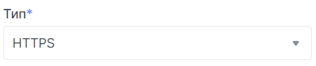

# Створення балансувальника навантаження

1. Перейдіть до підрозділу **Балансувальники навантаження**.


2.Натисніть на **Створити балансувальник навантаження**.


### Відомості про балансування навантаження

import Tabs from '@theme/Tabs';
import TabItem from '@theme/TabItem';

<Tabs>
<TabItem value="personal-area" label="Personal Area" default>

1. Введіть назву майбутнього балансувальника навантаження у полі **Назва балансувальника навантаження**.


2. Можете вказати IP адресу у полі **IP-адреса**.


3. Додайте опис балансувальника навантажень, при необхідності.


4. Також є можливість змінити статус активності("увімкнений" | "вимкнутий") балансувальник навантажень.


5. Переконайтесь, що заповнили всі необхідні поля - натисніть **Продовжити**


</TabItem>
<TabItem value="openstack" label="Openstack CLI">

Переконайтеся, що клієнт OpenStack [встановлений](#) і ви можете [авторизуватись](#) для його використання.
Виконайте потрібні команди.

```
openstack loadbalancer create --name <name> / 
                              --description <description> / 
                              --vip-subnet-id <vip_subnet_id> /
                              --enable | --disable /
```

`--name <name>` - Нове ім'я балансувальника навантаження.

`--description <description>` - Встановити опис балансувальника навантаження.

`--vip-subnet-id <vip_subnet_id>` - Встановити підмережу для балансувальника навантаження (ім'я або ID).

`--enable` - Увімкнути балансувальник навантаження (за умовчанням).

`--disable` - Вимкнути балансувальник навантаження.

</TabItem>
</Tabs>

### Відомості про слухача

<Tabs>
<TabItem value="personal-area" label="Personal Area" default>

1. Введіть назву слухача у поле **Назва**.


2. Опишіть слухача, за необхідності.


3. Виберіть протокол для слуховування.


4. Введіть порт, який плануєте прослуховувати.


5. Також є можливість відредагувати додаткові налаштування натиснувши на **Додаткові налаштування** та змінити приведені дані на необхідні вам.


6. Переконайтесь, що заповнили всі необхідні поля - натисніть **Продовжити**


</TabItem>
<TabItem value="openstack" label="Openstack CLI">

Переконайтеся, що клієнт OpenStack [встановлений](#) і ви можете [авторизуватись](#) для його використання.
Виконайте потрібні команди.

```
openstack loadbalancer listener create
    --description <description> /
    --protocol {TCP,HTTP,HTTPS,TERMINATED_HTTPS} /
    --connection-limit <limit> /
    --default-pool <pool> /
    --default-tls-container-ref <container-ref> /
    --sni-container-refs [<container-ref> [<container-ref> ...]] /
    --insert-headers <header=value,...> /
    --protocol-port <port> /
    --enable | --disable /
    <load_balancer>
```

`--name <name>` - Встановити ім'я прослуховувача.

`--description <description>` - Встановити опис цього прослуховувача.

`--protocol {TCP,HTTP,HTTPS,TERMINATED_HTTPS}` - Протокол для прослуховувача.

`--connection-limit <limit>` - Максимальна кількість дозволених підключень для цього прослуховувача.

`--default-pool <pool>` - Ім'я або ID пула, використовуваного прослуховувачем, якщо не відбувається відповідність L7-політики.

`--default-tls-container-ref <container-ref>` - URI контейнера секретів служби менеджера ключів, що містить сертифікат і ключ для прослуховувачів TERMINATED_TLS.

`--sni-container-refs [<container-ref> [<container-ref> ...]]` - Список URI контейнерів секретів служби менеджера ключів, що містять сертифікати та ключі для прослуховувача TERMINATED_TLS з використанням Server Name Indication.

`--insert-headers <header=value,...>` - Словник необов'язкових заголовків для вставки в запит перед надсиланням його на робочий учасник.

`--protocol-port <port>` - Встановити номер протокольного порту для прослуховувача.

`--enable` - Увімкнути прослуховувача (за умовчанням).

`--disable` - Вимкнути прослуховувача.

`<load_balancer>` - Балансувальник навантаження для прослуховувача (ім'я або ID).

</TabItem>
</Tabs>


### Деталі пулу

<Tabs>
<TabItem value="personal-area" label="Personal Area" default>

1. Введіть назву пулу.


2. За необзідності додайте опис вашого пулу.


3. Оберіть алгоритм за яким буде розподілятись навантаження.


4. Доповніть данні для налаштування розподілу навантаження у полі **Session Precentile**.


5. Також є можливість змінити статус активності("увімкнений" | "вимкнутий") пула.


</TabItem>
<TabItem value="openstack" label="Openstack CLI">

Переконайтеся, що клієнт OpenStack [встановлений](#) і ви можете [авторизуватись](#) для його використання.
Виконайте потрібні команди.

```
openstack loadbalancer pool create    
    --name <name> /
    --description <description> /
    --protocol {TCP,HTTP,HTTPS,TERMINATED_HTTPS,PROXY} /
    --listener <listener> /
    --loadbalancer <load_balancer> /
    --session-persistence <session persistence> /
    --lb-algorithm {SOURCE_IP,ROUND_ROBIN,LEAST_CONNECTIONS} /
    --enable | --disable /
```

`--name <name>` - Встановити ім'я пула.

`--description <description>` - Встановити опис пула.

`--protocol {TCP,HTTP,HTTPS,TERMINATED_HTTPS,PROXY}` - Встановити протокол пула.

`--listener <listener>` - Додати пул до прослуховувача (ім'я або ID).

`--loadbalancer <load_balancer>` - Додати пул до балансувальника навантаження (ім'я або ID).

`--session-persistence <session persistence>` - Встановити збереження сесії для прослуховувача (ключ=значення).

`--lb-algorithm {SOURCE_IP,ROUND_ROBIN,LEAST_CONNECTIONS}` - Вибрати алгоритм балансування навантаження для використання.

`--enable` - Увімкнути пул (за умовчанням).

`--disable` - Вимкнути пул.

</TabItem>
</Tabs>

### Пул учасників

<Tabs>
<TabItem value="personal-area" label="Personal Area" default>

- Можете додати учасників пулу самостійно учасника натиснувши на **Додати зовнішнього учасника** та заповнивши усі необхідні поля.

   

- Можете додати до учасників пулу ваші інстанси.

  1.) Натисніть на **Дадоти існуючі Інстанси**
  
  2.) Серед приведенних інстенсів виберіть необхідний та натисніть на **Додати**, у полі цього інстансу.
      
  3.) Заповніть поля, що залишились пустими.
      


</TabItem>
<TabItem value="openstack" label="Openstack CLI">

Переконайтеся, що клієнт OpenStack [встановлений](#) і ви можете [авторизуватись](#) для його використання.
Виконайте потрібні команди.

```
openstack loadbalancer member create --name <name>
                                     --weight <weight>
                                     --address <ip_address>
                                     --subnet-id <subnet_id>
                                     --protocol-port <protocol_port>
                                     --monitor-port <monitor_port>
                                     --monitor-address <monitor_address>
                                     --enable | --disable
                                     <pool>
```

`--name <name>` - Встановити ім'я учасника.

`--weight <weight>` - Вага учасника визначає частку запитів або з'єднань, які він обслуговує порівняно з іншими учасниками пула.

`--address <ip_address>` - IP-адреса сервера учасника на стороні сервера.

`--subnet-id <subnet_id>` - Ідентифікатор підмережі, з якої можна отримати доступ до послуги учасника.

`--protocol-port <protocol_port>` - Номер порту протоколу, на якому прослуховується сервер учасника на стороні сервера.

`--monitor-port <monitor_port>` - Альтернативний номер порту протоколу, який використовується для моніторингу стану учасника на стороні сервера.

`--monitor-address <monitor_address>` - Альтернативна IP-адреса, яка використовується для моніторингу стану учасника на стороні сервера.

`--enable` - Увімкнути учасника (за умовчанням).

`--disable` - Вимкнути учасника.

`<pool>` - Ідентифікатор або ім'я пула, для якого створюється учасник.

</TabItem>
</Tabs>

### Детальний моніторинг

<Tabs>
<TabItem value="personal-area" label="Personal Area" default>

1. Введіть назву детального моніторингу налаштувань дитального моніторингу у полі **Назва**.

   

2. Оберіть протокол у полі **Тип**.

    

3. При необхідності заповніть додаткові поля, пов'язані з протоколом, у нашому випадку - метод запиту у полі **HTTP method**.
 
    

4. Оберіть код вірної відповіді.

   

5. Відкоректуйте url, який буде прослуховуватись.

   

6. Вкажіть максимальну кількість дозволених помилок перевірки перед зміною робочого стану учасника на **ПОМИЛКА** та вкажіть час очікування.

   

7. Кількість успішних перевірок перед зміною робочого статусу учасника на **ОНЛАЙН** та час затримки між запитами.

   

8. Також є можливість змінити статус активності("увімкнений" | "вимкнутий") моніторингу.

   


</TabItem>
<TabItem value="openstack" label="Openstack CLI">

Переконайтеся, що клієнт OpenStack [встановлений](#) і ви можете [авторизуватись](#) для його використання.
Виконайте потрібні команди.

```
openstack loadbalancer healthmonitor create
    --name <name>
    --delay <delay>
    --expected-codes <codes>
    --http_method {GET,POST,DELETE,PUT,HEAD,OPTIONS,PATCH,CONNECT,TRACE}
    --timeout <timeout>
    --max-retries <max_retries>
    --url-path <url_path>
    --type {PING,HTTP,TCP,HTTPS,TLS-HELLO}
    --max-retries-down <max_retries_down>
    --enable | --disable
    <pool>
```

`--name <name>` - Встановіть ім'я монітора стану.

`--delay <delay>` - Встановіть час в секундах між відправленням запитів до учасників.

`--expected-codes <codes>` - Встановіть список HTTP-кодів статусу, очікуваних у відповіді від учасника для визначення його статусу "здоровий".

`--http_method {GET,POST,DELETE,PUT,HEAD,OPTIONS,PATCH,CONNECT,TRACE}` - Встановіть HTTP-метод, який використовується монітором стану для запитів.

`--timeout <timeout>` - Встановіть максимальний час, в секундах, який монітор очікує на з'єднання перед тим, як час вийде. Значення повинно бути меншим за значення затримки.

`--max-retries <max_retries>` - Кількість успішних перевірок перед зміною робочого стану учасника на "В ОНЛАЙН".

`--url-path <url_path>` - Встановіть HTTP URL-шлях запиту, який відправляє монітор для тестування стану учасника.

`--type {PING,HTTP,TCP,HTTPS,TLS-HELLO}` - Встановіть тип монітора стану.

`--max-retries-down <max_retries_down>` - Встановіть кількість допустимих невдалих перевірок перед зміною робочого стану учасника на "ПОМИЛКА".

`--enable` - Увімкнути монітор стану (за умовчанням).

`--disable` - Вимкнути монітор стану.

`<pool>` - Вкажіть пул для монітора стану (ім'я або ID).

</TabItem>
</Tabs>

## Cтворіть новий балансувальник навантаження.

1. На зображені приведено лише приклад того, як буде відображенно підсумування ваших налаштувань.

   

2. Натисніть **Створити**
   
   

