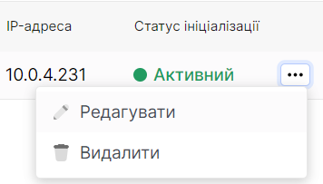
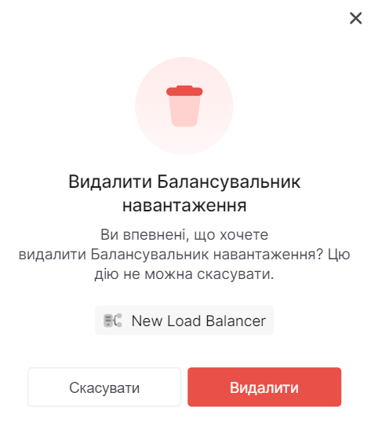

# Видалення балансувальника навантаження

import Tabs from '@theme/Tabs';
import TabItem from '@theme/TabItem';

<Tabs>
<TabItem value="personal-area" label="Personal Area" default>

1. Перейдіть до підрозділу **Балансувальники навантаження**.


2. Оберіть необхідний балансувальник навантаження, натисніть на трьокрапку у полі балансувальника навантаження, та у контекстному меню виберіть **Видалити**.



3. У вікні видалення натисніть **Видалити**.




</TabItem>
<TabItem value="openstack" label="Openstack CLI">

Переконайтеся, що клієнт OpenStack [встановлений](#) і ви можете [авторизуватись](#) для його використання.
Виконайте потрібні команди.

```
openstack loadbalancer delete --cascade <load_balancer>
```

`--cascade` - Каскадно видалення до всіх дочірніх елементів балансувальника навантаження.

`loadbalancer` - Балансувальники навантаження для видалення (ім’я або ідентифікатор).

</TabItem>
</Tabs>