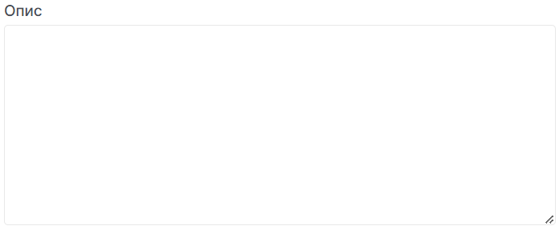

# Редагувати балансувальник навантаження

import Tabs from '@theme/Tabs';
import TabItem from '@theme/TabItem';

<Tabs>
<TabItem value="personal-area" label="Особистий кабінет" default>

1. Перейдіть до підрозділу **Балансувальники навантаження**.


2. Оберіть необхідний балансувальник навантаження, натисніть на трьокрапку у полі балансувальник навантаження,та у контекстному меню виберіть **Редагувати**.


3. Змініть ім'я балансувальника навантажень у полі **Назва**.


4. За необхідністью можете редагувати опис балансувальника навантажень у полі **Опис**.



5. Також є можливість змінити статус активності("увімкнений" | "вимкнутий") балансувальник навантажень.


6. Після внесення всіх необхідних правок натисніть **Редагувати**.


</TabItem>
<TabItem value="openstack" label="Openstack CLI">

Переконайтеся, що клієнт OpenStack [встановлений](#) і ви можете [авторизуватись](#) для його використання.
Виконайте потрібні команди.

```
openstack loadbalancer set --enable | --disable / 
                           --name <name> / 
                           --description <description> / 
                           <load_balancer>
```


`<load_balancer>` - Ім’я або UUID балансувальника навантаження для оновлення.

`--enable` - Enable load balancer.

`--disable` - Disable load balancer.

`--name <name>` - Set load balancer name.

`--description <description>` - Set load balancer description.

</TabItem>
</Tabs>
