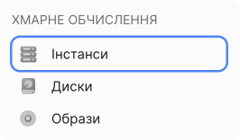
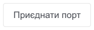

# Управління портами

Ви можете керувати портами: переглядати порти, додавати, редагувати та видаляти їх.

## Перегляд списку портів у мережі

1. Перейдіть до **Мережі**.

Буде відображено список мереж.

2. Натисніть на назву потрібної мережі.

Відкриється сторінка з детальною інформацією про неї.

3. Перейдіть на вкладку **Порти**.

Буде відображено список портів.

## Перегляд списку портів прикріплених до інстансу

1. Перейдіть до **Інстанси**.

Буде відображено список інстансів.

2. Натисніть на назву потрібного інстансу.

Відкриється сторінка з детальною інформацією про нього.

3. Перейдіть на вкладку **Мережа**.

Буде відображено список підключених портів к цьому інстансу.

## Додавання порту до інстансу

1. Перейдіть до **Інстанси**.

Буде відображено список інстансів.

2. Натисніть на назву потрібного інстансу.

Відкриється сторінка з детальною інформацією про нього.

3. Перейдіть на вкладку **Мережа**.

Буде відображено список підключених портів к цьому інстансу.

4. Нажміть на **Додати порт**.

5. Виберіть у якій мережі та підмережі додаємо порт.

6. Нажміть на **Додати порт**.

## Видалення порту

> :warning: **Неможливо видалити порт, якщо він використовується маршрутизатором.**

1. Перейдіть до **Мережі**.

Буде відображено список мереж.

2. Натисніть на назву потрібної мережі.

Відкриється сторінка з детальною інформацією про неї.

3. Перейдіть на вкладку **Порти**.

Видаліть порт одним із способів:

За допомогою чекбоксів:

- Виберіть потрібний порт за допомогою чекбокса.

- Натисніть кнопку **Видалити**.

- Підтвердіть виконання операції.

За допомогою контекстного меню:

- Розкрийте меню потрібного порту та виберіть пункт **Видалити порт**.

- Підтвердіть виконання операції.

## Від'єднати порт

1. Перейдіть до **Інстанси**.

Буде відображено список інстансів.

2. Натисніть на назву потрібного інстансу.

Відкриється сторінка з детальною інформацією про нього.

3. Перейдіть на вкладку **Мережа**.

Буде відображено список підключених портів к цьому інстансу.

За допомогою контекстного меню:

- Розкрийте меню потрібного порту та виберіть пункт **Від'єднати порт**.

- Підтвердіть виконання операції.

## Приєднати порт

1. Перейдіть до **Інстанси**.

Буде відображено список інстансів.

2. Натисніть на назву потрібного інстансу.

Відкриється сторінка з детальною інформацією про нього.

3. Перейдіть на вкладку **Мережа**.

Буде відображено список підключених портів к цьому інстансу.

4. Нажміть кнопку **Приєднати порт**.

5. Виберіть порт який потрібно приєднати.

6. Нажміть кнопку **Приєднати**.