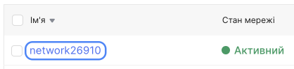
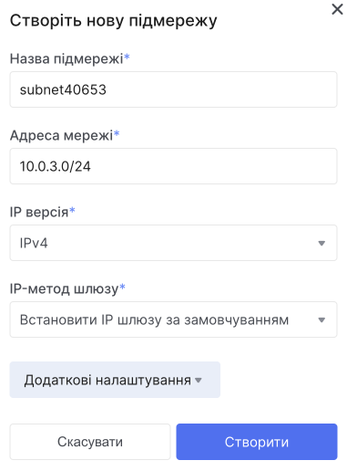
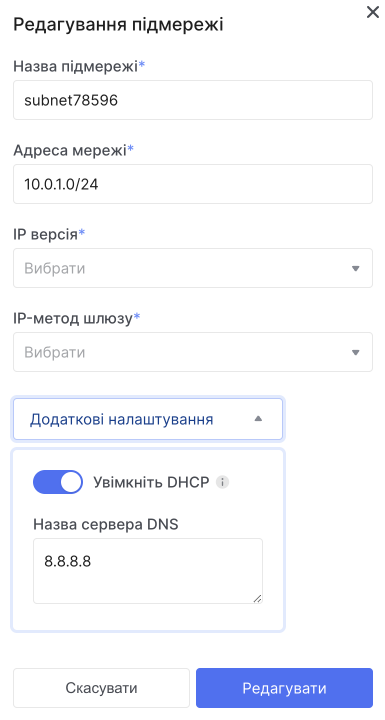
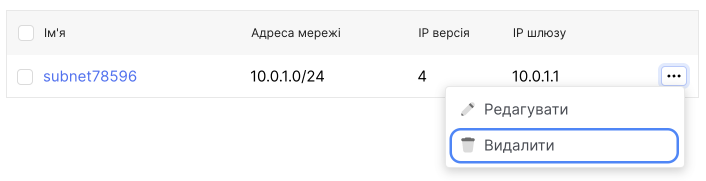

# Управління підмережою

## Створення підмережі

1. Перейдіть до **Мережі**.

2. У списку мереж знайдіть потрібну мережу та натисніть назву мережі, в якій потрібно створити підмережу.

3. Натисніть кнопку **Створити підмережу**.

- Вкажіть назву підмережі.

- Введіть IP-адресу, IP версію та шлюз підмережі.

- У додаткових налаштуваннях, ви зможете налаштувати DHCP. (опційно) За замовчуванням DHCP увімкнено. Адреси, видані DHCP-сервером, залишатимуться постійними. Вимкнення DHCP призведе до того, що IP-адреси, видані DHCP-сервісом, перестануть обслуговуватися. Це може призвести до відсутності віртуальних машин. Якщо потрібно, вимкніть його.

- Вкажіть пул DHCP IP-адрес.

- Натисніть кнопку **Створити**.

## Редагування підмережі

1. Перейдіть до **Мережі**.

2. У списку мереж знайдіть потрібну мережу та натисніть назву мережі, в якій потрібно відредагувати підмережу.

3. Натисніть на назву підмережі яку ви хочете відредагувати.

## Видалення підмережі

1. Перейдіть до **Мережі**.

2. У списку мереж знайдіть потрібну мережу та натисніть назву мережі, в якій потрібно видалити підмережу.

4. Розгорніть контекстне меню підмережі яку потрібно видалити.

5. Виберіть дію **Видалити**.

