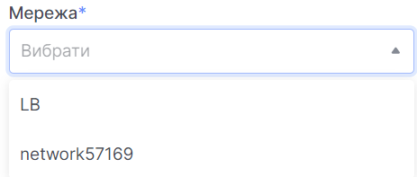
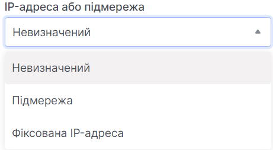
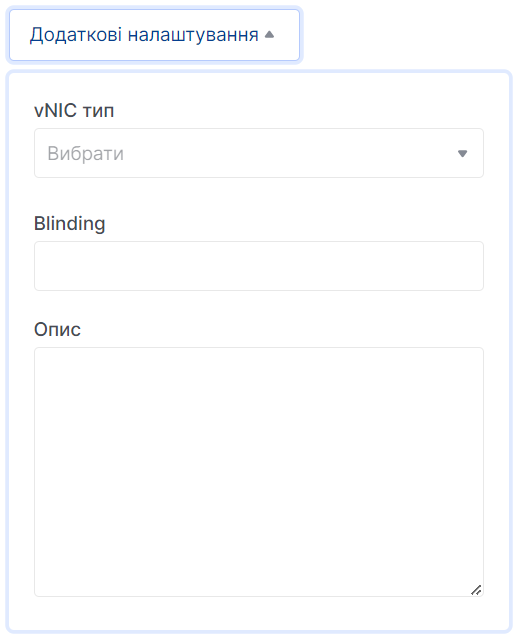

# Створення порту

import Tabs from '@theme/Tabs';
import TabItem from '@theme/TabItem';

<Tabs>
<TabItem value="personal-area" label="Особистий кабінет" default>

1. Перейдіть до підрозділу **Порти**.


2. Натисніть на **Створити порти**.


3. Введіть назву майбутнього порту у полі **Назва порту**.


4. Оберіть мережу у полі **Мережа**.



5. Залиште увімкнутим, або вимкніть порт.


6. Оберіть до чого буде прив'язаний порт. Якщо Ви вкажете підмережу, OpenStack Networking виділяє доступну IP-адресу з цієї підмережі на порт.
   Якщо Ви вказуєте IP-адресу, OpenStack Networking намагається призначити IP-адресу, якщо ця адреса є дійсною для будь-якої з підмереж у вказаній мережі.



7. Вкажіть MAC-адресу порту. Якщо не вказано, MAC-адреса генерується автоматично..


8. Якщо на меті стоїть ізоляція порта - залишіть поле без змін.


9. Залишіть увімкненим, якщо хочете додати стандартну групу безпеки.


10. Натисніть на **Додаткові налаштування** для розгортання списку додаткових полів налаштувань, серед яких є: 
    вибрір vNIC типу, blinding, опис.



11. Натисніть **Створити**.


</TabItem>
<TabItem value="openstack" label="Openstack CLI">

Переконайтеся, що клієнт OpenStack [встановлений](#) і ви можете [авторизуватись](#) для його використання.
Виконайте потрібні команди.

```
openstack port create --network <network> /
    [--description <description>] /
    [--mac-address <mac-address>] /
    [--vnic-type <vnic-type>] /
    [--fixed-ip subnet=<subnet>,ip-address=<ip-address> | --no-fixed-ip] /
    [--enable | --disable] /
    [--security-group <security-group> | --no-security-group] /
    [--enable-port-security | --disable-port-security] /
    [--allowed-address ip-address=<ip-address>[,mac-address=<mac-address>]] /
    <name>        
```

`--network <network>` - Мережа, до якої належить цей порт (назва або ID).

`--mac-address <mac_address>` - MAC-адреса цього порту (тільки для адміністраторів).

`--vnic-type <vnic-type>` - Тип vNIC для цього порту (direct | direct-physical | macvtap | normal | baremetal | virtio-forwarder, за замовчуванням: normal).

`--fixed-ip subnet=< subnet >,ip-address=<ip_address>` - Бажана IP-адреса і / або підмережа для цього порту (назва або ID): subnet=< subnet >,ip-address=<ip_address> (повторіть параметр, щоб встановити кілька фіксованих IP-адрес).

`--enable` - Увімкнути порт (за замовчуванням).

`--disable` - Вимкнути порт.

`--security-group <security-group>` - Група безпеки для асоціації з цим портом (назва або ID) (повторіть параметр, щоб встановити кілька груп безпеки).

`--no-security-group` - Асоціювати з цим портом жодну з груп безпеки.

`--enable-port-security` - Увімкнути безпеку порту для цього порту (за замовчуванням).

`--disable-port-security` - Вимкнути безпеку порту для цього порту.

`--allowed-address ip-address=<ip_address>[,mac-address=<mac_address>]` - Додати дозволену пару адрес, пов'язану з цим портом: ip-address=<ip_address>[,mac-address=<mac_address>] (повторіть параметр, щоб встановити кілька дозволених пар адрес).

`name` - Назва цього порту.

</TabItem>
</Tabs>
