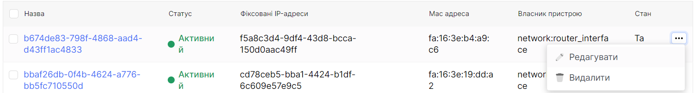
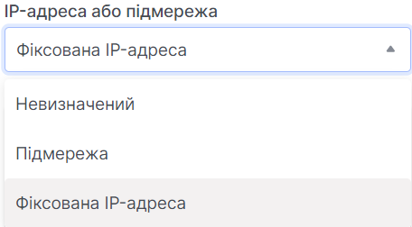
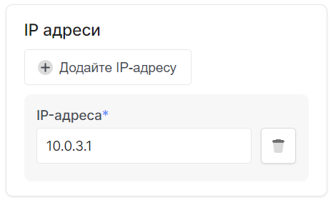
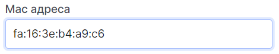
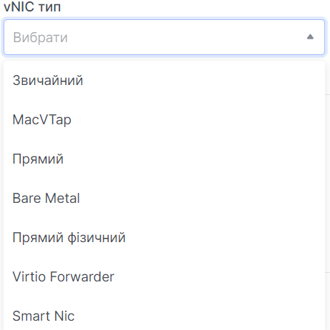

# Редагувати порту

import Tabs from '@theme/Tabs';
import TabItem from '@theme/TabItem';

<Tabs>
<TabItem value="personal-area" label="Особистий кабінет" default>

1. Перейдіть до підрозділу **Порти**.


2. Оберіть необхідний порт, натисніть на трьокрапку у полі порту,та у контекстному меню виберіть **Редагувати**.



3. За необхідності змініть назву порту у полі **Назва порту**.


4. Також є можливість змінити статус активності("увімкнений" | "вимкнутий") порт.


5. За необхідністью можете редагувати поле, що відповідає за походження порту. 



6. Можете додати, або видалити ІP адреси порту у полі **ІP адреси**.



7. Є можливість відредагувати поле **Mac адреса**.



8. Редагування ізоляції порту доступне у полі **Безпека порту**.


9. Зміна типу vNIC доступна у одноуменному полі.



10. Зміна опису доступна у одноіменному полі.


11. Після внесення всіх необхідних правок натисніть **Редагувати**.


</TabItem>
<TabItem value="openstack" label="Openstack CLI">

Переконайтеся, що клієнт OpenStack [встановлений](#) і ви можете [авторизуватись](#) для його використання. Виконайте потрібні команди.    


```
openstack port create
    [--description <description>] /
    [--mac-address <mac-address>] /
    [--vnic-type <vnic-type>] /
    [--fixed-ip subnet=<subnet>,ip-address=<ip-address> | --no-fixed-ip] /
    [--enable | --disable] /
    [--security-group <security-group> | --no-security-group] /
    [--enable-port-security | --disable-port-security] /
    [--allowed-address ip-address=<ip-address>[,mac-address=<mac-address>]] /
    [--name <name>]
    <port>        
```

`--mac-address <mac_address>` - MAC-адреса цього порту (тільки для адміністраторів).

`--vnic-type <vnic-type>` - Тип vNIC для цього порту (direct | direct-physical | macvtap | normal | baremetal | virtio-forwarder, за замовчуванням: normal).

`--fixed-ip subnet=< subnet >,ip-address=<ip-address>` - Бажана IP-адреса і / або підмережа для цього порту (назва або ID): subnet=< subnet >,ip-address=<ip_address> (повторіть параметр, щоб встановити кілька фіксованих IP-адрес).

`--enable` - Увімкнути порт (за замовчуванням).

`--disable` - Вимкнути порт.

`--security-group <security-group>` - Група безпеки для асоціації з цим портом (назва або ID) (повторіть параметр, щоб встановити кілька груп безпеки).

`--no-security-group` - Асоціювати з цим портом жодну з груп безпеки.

`--enable-port-security` - Увімкнути безпеку порту для цього порту (за замовчуванням).

`--disable-port-security` - Вимкнути безпеку порту для цього порту.

`--allowed-address ip-address=<ip_address>[,mac-address=<mac_address>]` - Додати дозволену пару адрес, пов'язану з цим портом: ip-address=<ip_address>[,mac-address=<mac_address>] (повторіть параметр, щоб встановити кілька дозволених пар адрес).

`--name` - Встановити ім'я порту.

`port` - Порт для видалення (ім’я або ідентифікатор)

</TabItem>
</Tabs>
