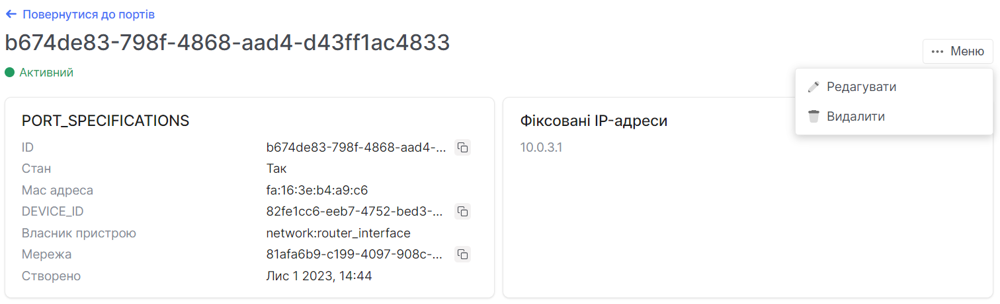

# Загальна інформація

import Tabs from '@theme/Tabs';
import TabItem from '@theme/TabItem';

<Tabs>
<TabItem value="personal-area" label="Особистий кабінет" default>


1. Перейдіть до підрозділу **Порти**.


2. Оберіть необхідний порт, та натисніть на його ім'я (назву).


3. На даній сторінці зображена детальна інформація по порту та є можливість редагувати, видаляти.



</TabItem>
<TabItem value="openstack" label="Openstack CLI">

Переконайтеся, що клієнт OpenStack [встановлений](#) і ви можете [авторизуватись](#) для його використання. Виконайте потрібні команди.    

```
openstack port show <port>
```

`port` - Порт для відображення (назва або ідентифікатор).

</TabItem>
</Tabs>
