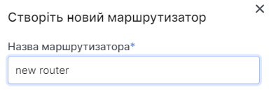

# Створення маршрутизатора

import Tabs from '@theme/Tabs';
import TabItem from '@theme/TabItem';

<Tabs>
<TabItem value="personal-area" label="Особистий кабінет" default>

1. Перейдіть до підрозділу **Маршрутизатори**.


2. Натисніть на **Створити маршрутизатор**.


3. Введіть назву майбутнього маршрутизатора у полі **Назва маршрутизатора**.



4. Дозвольте або забороніть доступ маршрутизатора до інтернету використовуючи світч **Доступ до інтернету**. Від початку встановлено у значення увімкнено.


5. Оберіть підмережу з вже інсуючих, або залиште поле пустим, для створення маршрутизатора без інтерфейсів, додати інтерфейси буде можливість у будь-який час.


6. Виберіть стан маршрутизатора "увімкнутий" | "вимкнутий". Від початку встановлено у значення "увімкнено".


7. Натисніть **Створити**.


</TabItem>
<TabItem value="openstack" label="Openstack CLI">

Переконайтеся, що клієнт OpenStack [встановлений](#) і ви можете [авторизуватись](#) для його використання.
Виконайте потрібні команди.

```
openstack router create --enable | --disable / <name>          
```

`--enable` - Включить маршрутизатор (по умолчанию).

`--disable` - Вимкнути маршрутизатор.

</TabItem>
</Tabs>
