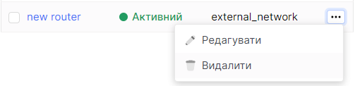

import Tabs from '@theme/Tabs';
import TabItem from '@theme/TabItem';

# Видалення маршрутизатора

<Tabs>
<TabItem value="personal-area" label="Особистий кабінет" default>

1. Перейдіть до підрозділу **Маршрутизатори**.


2. Оберіть необхідний маршрутизатор, натисніть на трьокрапку у полі маршрутизатора, та у контекстному меню виберіть **Видалити**.



3. У вікні видалення натисніть **Видалити**.


</TabItem>
<TabItem value="openstack" label="Openstack CLI">

Переконайтеся, що клієнт OpenStack [встановлений](#) і ви можете [авторизуватись](#) для його використання.
Виконайте потрібні команди.    

```
openstack router delete <router-name>
```

</TabItem>
</Tabs>