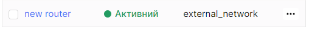
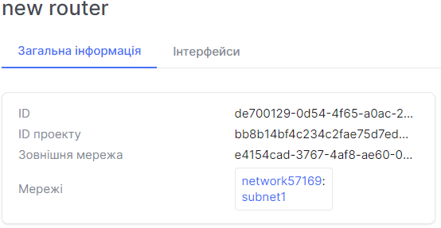
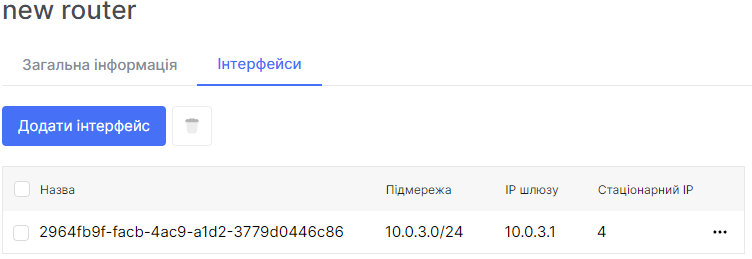
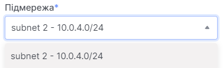
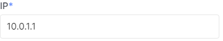
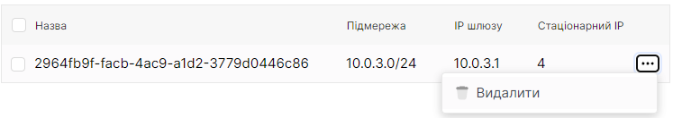

# Загальна інформація
1. Перейдіть до підрозділу **Маршрутизатори**.


2. Оберіть необхідний маршрутизатор, та натисніть на його ім'я (назву).



На даній сторінці зображена детальна інформація по маршрутизатору.



# Додати інтерфейс

import Tabs from '@theme/Tabs';
import TabItem from '@theme/TabItem';

<Tabs>
<TabItem value="personal-area" label="Особистий кабінет" default>

1. Перейдіть до підрозділу **Маршрутизатори**.


2. Оберіть необхідний маршрутизатор, та натисніть на його ім'я (назву).


3. Перейдіть до розділу **Інтерфейси**. Та натисніть на **Додати інтерфейс**.



4. Оберіть підмережу для інтерфейсу у полі **Підмережа**.



5. Вкажіть IP адресу інтерфейсу у полі **IP**.



6. Натисніть на кнопку **Додати**.


</TabItem>
<TabItem value="openstack" label="Openstack CLI">

Переконайтеся, що клієнт OpenStack [встановлений](#) і ви можете [авторизуватись](#) для його використання. Виконайте потрібні команди.    

```
openstack router add route --route destination=<subnet>,gateway=<ip-address> <router>
```

`--route destination=<subnet>,gateway=<ip-address>` - Додайте до маршрутизатора додатковий статичний маршрут. призначення: підмережа призначення (в нотації CIDR), шлюз: IP-адреса наступного переходу. Опція повторення, щоб додати кілька маршрутів. Спроба додати маршрут, який уже присутній (точно, включаючи пункт призначення та наступний крок) у таблицю маршрутизації, дозволена та вважається успішною операцією.

`router` - Маршрутизатор, до якого будуть додані додаткові статичні маршрути (назва або ID).

</TabItem>
</Tabs>

# Видалити інтерфейс

<Tabs>
<TabItem value="personal-area" label="Особистий кабінет" default>

1. Перейдіть до підрозділу **Маршрутизатори**.


2. Оберіть необхідний маршрутизатор, та натисніть на його ім'я (назву).


3. Перейдіть до розділу **Інтерфейси**.


4. Оберіть необхідне інтерфейс, натисніть на трьокрапку у полі інтерфейса,та у контекстному меню виберіть **Видалити**.



5. У вікні видалення оберіть **Видалити**.


</TabItem>
<TabItem value="openstack" label="Openstack CLI">

Переконайтеся, що клієнт OpenStack [встановлений](#) і ви можете [авторизуватись](#) для його використання. Виконайте потрібні команди.    

```
openstack router remove route --route destination=<subnet>,gateway=<ip-address> <router>
```

`--route destination=<subnet>,gateway=<ip-address>` - Видаліть додатковий статичний маршрут з маршрутизатора. призначення: підмережа призначення (в нотації CIDR), шлюз: IP-адреса наступного переходу. Опція повторення, щоб видалити кілька маршрутів. Спроба видалити з таблиці маршрутизації маршрут, якого вже немає (повністю, включно з пунктом призначення та наступним переходом), дозволена та вважається успішною операцією.

`router` - Маршрутизатор, до якого буде додано додаткові статичні маршрути (ім'я або ідентифікатор).

</TabItem>
</Tabs>