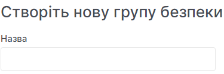
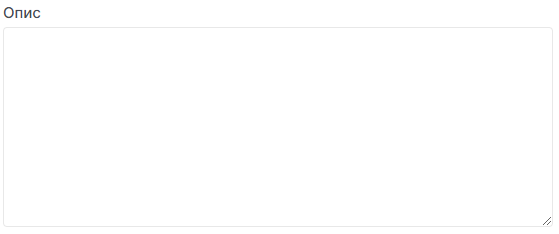

# Створення групи безпеки

import Tabs from '@theme/Tabs';
import TabItem from '@theme/TabItem';

<Tabs>
<TabItem value="personal-area" label="Personal Area" default>

1. Перейдіть до підрозділу **Групи безпеки**.


2. Натисніть на **Створити групу безпеки**.


3. Введіть назву майбутньої групи безпеки у полі **Назва**.



4. Можете ввести додатковий опис групи безпеки у поле **Опис**.



5. Натисніть **Створити**.


</TabItem>
<TabItem value="openstack" label="Openstack CLI">

Переконайтеся, що клієнт OpenStack [встановлений](#) і ви можете [авторизуватись](#) для його використання.
Виконайте потрібні команди.

```
openstack security group create --description <description> <security-group-name>
```

`--description <description>` - Визначає опис групи безпеки.
`<security-group-name>` - Це назва нової групи безпеки.

</TabItem>
</Tabs>
