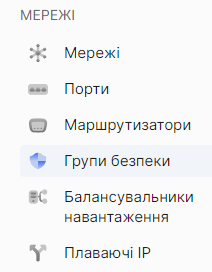

import Tabs from '@theme/Tabs';
import TabItem from '@theme/TabItem';

# Видалення групи безпеки

<Tabs>
<TabItem value="personal-area" label="Personal Area" default>

1. Перейдіть до підрозділу **Групи безпеки**.



2. Оберіть необхідну групу безпеки, натисніть на трьокрапку у полі групи безпеки,та у контекстному меню виберіть **Видалити**.


3. У вікні видалення натисніть **Видалити**.


</TabItem>
<TabItem value="openstack" label="Openstack CLI">

Переконайтеся, що клієнт OpenStack [встановлений](#) і ви можете [авторизуватись](#) для його використання.
Виконайте потрібні команди.    

```openstack security group delete <security-group-name>```

</TabItem>
</Tabs>