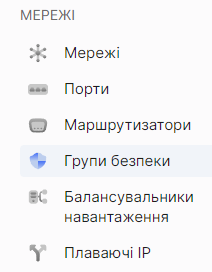
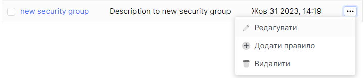
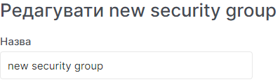
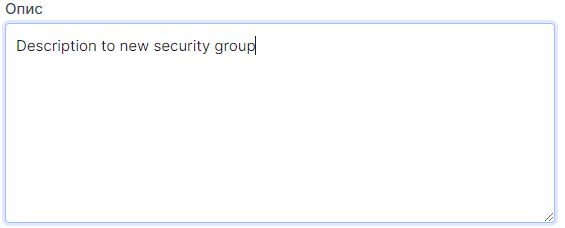

# Редагувати групи безпеки

import Tabs from '@theme/Tabs';
import TabItem from '@theme/TabItem';

<Tabs>
<TabItem value="personal-area" label="Personal Area" default>

1. Перейдіть до підрозділу **Групи безпеки**.



2. Оберіть необхідну групу безпеки, натисніть на трьокрапку у полі групи безпеки,та у контекстному меню виберіть **Редагувати**.



3. Змініть назву групи безпеки у полі **Назва**.



4. Змініть додатковий опис групи безпеки у полі **Опис**.



5. Натисніть створити.


</TabItem>
<TabItem value="openstack" label="Openstack CLI">

Переконайтеся, що клієнт OpenStack [встановлений](#) і ви можете [авторизуватись](#) для його використання. Виконайте потрібні команди.    

```
openstack security group set --name <new-name> --description <description> <security-group-name>
```

`--name <new-name>` - Це нова назва групи безпеки.
`--description <description>` - New security group description.

</TabItem>
</Tabs>
