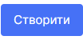
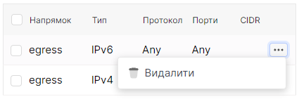

# Додати правило

import Tabs from '@theme/Tabs';
import TabItem from '@theme/TabItem';

<Tabs>
<TabItem value="personal-area" label="Personal Area" default>

1. Перейдіть до підрозділу **Групи безпеки**.


2. Оберіть необхідну групу безпеки, натисніть на трьокрапку у полі групи безпеки,та у контекстному меню виберіть **Додати правило**.


3. Оберіть протокол правил у полі **протокол правил**.


4. Оберіть напрямок правила у полі **Напрямок**.


5. Оберіть діапазон IP адрес у полі **CIDR**.


6. Є можливість додати опис правилу у полі **Опис**.


7. Натисніть **Створити**.



</TabItem>
<TabItem value="openstack" label="Openstack CLI">

Переконайтеся, що клієнт OpenStack [встановлений](#) і ви можете [авторизуватись](#) для його використання. Виконайте потрібні команди.    

```
openstack security group rule create --remote-ip <ip-address> /
                                     --protocol <protocol> /
                                     --description <description> /
                                     --ingress | --egress /
                                     <security-group-name>    
```

`--remote-ip` -  Блок віддалених IP-адрес (можна використовувати нотацію CIDR; за замовчуванням для правила IPv4: 0.0.0.0/0)
`--protocol` - Протокол IP (ah, dccp, egp, esp, gre, icmp, igmp, ipv6-encap, ipv6-frag, ipv6-icmp, ipv6-nonxt, ipv6-opts, ipv6-route, ospf, pgm, rsvp, sctp, tcp, udp, udplite, vrrp та цілі числові представлення [0-255]; за замовчуванням: tcp)
`--ingress` - Правило застосовується до вхідного мережевого трафіку (за замовчуванням)
`--egress` - Правило застосовується до вихідного мережевого трафіку

</TabItem>
</Tabs>

<Tabs>
<TabItem value="personal-area" label="Personal Area" default>

# Видалити правило

1. Перейдіть до підрозділу **Групи безпеки**.


2. Натисніть на ім'я необхідної групи безпеки.


3. На сторінці детальної інформації буде виведено список правил.


4. Оберіть необхідне правило, натисніть на трьокрапку у полі правила,та у контекстному меню виберіть **Видалити**.



5. У вікні видалення оберіть **Видалити**.


</TabItem>
<TabItem value="openstack" label="Openstack CLI">

Переконайтеся, що клієнт OpenStack [встановлений](#) і ви можете [авторизуватись](#) для його використання. Виконайте потрібні команди.    

```
openstack security group rule delete <rule>
```

</TabItem>
</Tabs>