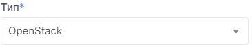

# OpenStack токен

## Отримання OpenStack токена

1. Перейдіть до сторінки [OpenStack token](https://console.ocplanet.cloud/account-settings/api-access).

2. Натисніть **Додати токен**.

3. Введіть назву токену.

4. Серед наведенних типів оберіть **OpenStack**.

5. Натисніть **Додати**.

