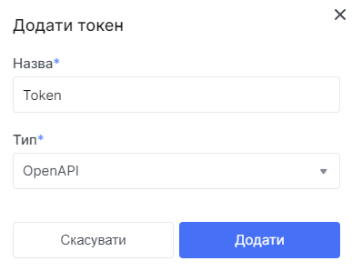
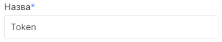
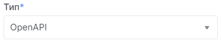

# OpenAPI токен

## Отримання OpenAPI токена

1. Перейдіть до сторінки [OpenAPIToken](https://console.ocplanet.cloud/account-settings/api-access).

2. Натисніть **Додати токен**.

3. У модульному вікні введіть назву токену.

4. Серед наведенних типів оберіть **OpenAPI**.

5. Натисніть **Додати**.

