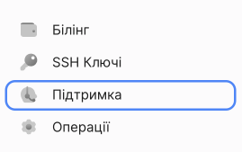

# Видалити аккаунт

Лише власник облікового запису може надіслати запит на видалення облікового запису.

1. Перед подачею запиту:

- відмовитися від активних послуг;
- [погасити борг](#).

2. На [панелі керування](https://console.ocplanet.cloud/) натисніть **Підтримка**.

3. Зверніться в службу технічної підтримки. При заповненні тикету в полі **Повідомлення** вкажіть причину видалення облікового запису.

4. Натисніть **Створити заявку**.

5. Після розгляду вашого запиту ми видалимо ваш обліковий запис.