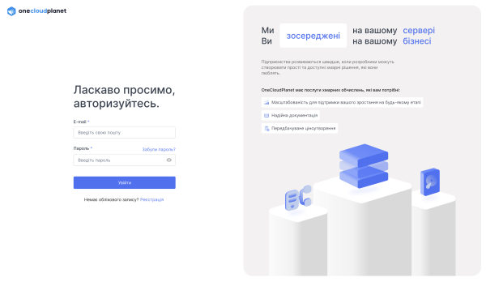
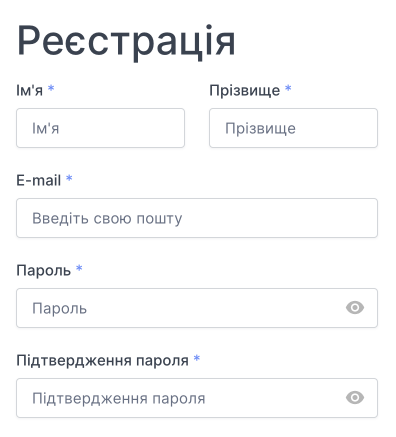
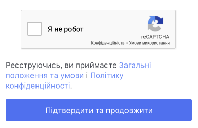
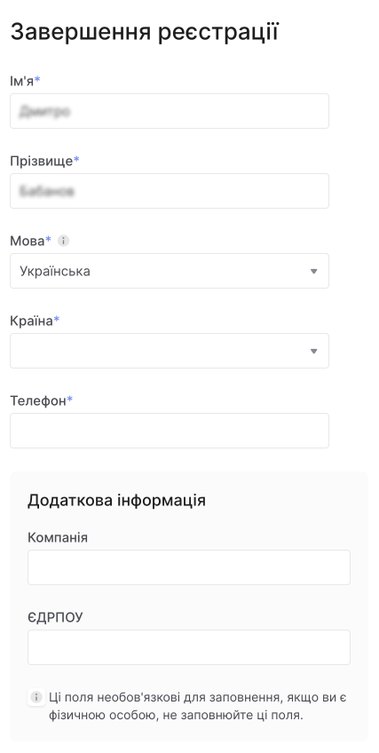
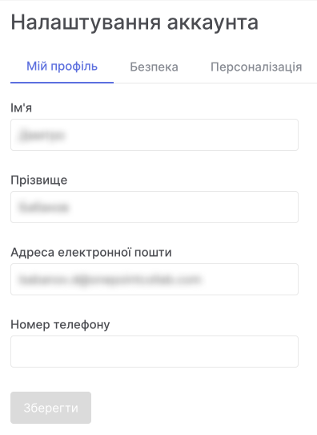

# Реєстрація в панелі управління

Керування хмарною платформою OneCloudPlanet здійснюється через панель управління [console.ocpanel.cloud](https://console.ocplanet.cloud/). Ви можете зареєструватися на інформаційній панелі OneCloudPlanet, виконавши такі дії:

- [через console.ocpanel.cloud](https://console.ocplanet.cloud/sign-in)

Якщо під час реєстрації у вас виникнуть проблеми, напишіть в службу технічної підтримки: [support@onecloudplanet.com](mailto:support@onecloudplanet.com).

## Реєстрація через onecloudplanet.com

Після реєстрації користувачеві буде призначено роль [Власник облікового запису](##).

1. На сайті [onecloudplanet.com](https://onecloudplanet.com/) у верхньому правому куті, натисніть **Підключитися**.

2. Заповніть реєстраційну форму.

3. Натисніть **Підтвердити та продовжити**.

4. Заповніть додаткову інформацію, включаючи країну та номеру телефону. Також у блоці **Додаткові налаштування** можно вказати назву компанії та її ІПН.

- **обліковий кабінет** - обліковий запис особистого користування з реєстрацією на фізичну особу;
- **бізнес-рахунок** - рахунок для використання організацією, зареєстрованою як юридична особа, індивідуальний підприємць або державний орган.

5. Додатково: Для бізнес-облікового запису введіть ІПН і назву компанії. Поля з усіма даними організації.

7. Ми надішлемо електронний лист із кодом підтвердження на вказану електронну адресу. Лист буде містити код, за шаблоном ААА-ААА. Якщо лист не прийшов, натисніть кнопку **Повторно надіслати код**, ще раз перевірте папку «Спам».

8. Введіть отриманий код.

9. Додатково: [налаштувати двоетапну перевірку](##).

## Реєстрація за запрошеннями

[Власник облікового запису](##) або [Адміністратор користувачей](##) може [пригласить нового користувача](##) до облікового запису. Після запрошення користувач отримає електронний лист із номером рахунку та посиланням для підтвердження. [Роль користувача](##) визначається користувачем, який надсилає запрошення.

1. Перейдіть за посиланням в електронному листі, щоб підтвердити запрошення.

2. Заповніть реєстраційну форму.

3. Натисніть **Зареєструватися**.

4. Заповніть додаткову інформацію, включаючи країну та номеру телефону. Також у блоці **Додаткові налаштування** можно вказати назву компанії та її ІПН.

- обліковий кабінет - обліковий запис особистого користування з реєстрацією на фізичну особу;
- бізнес-рахунок - рахунок для використання організацією, зареєстрованою як юридична особа, індивідуальний підприємць або державний орган.

5. Додатково: Для бізнес-облікового запису введіть ІПН і назву компанії. Поля з усіма даними організації.

6. Натисніть **Продовжити**

7. Ми надішлемо електронний лист із кодом підтвердження на вказану електронну адресу. Лист буде містити код, за шаблоном ААА-ААА. Якщо лист не прийшов, натисніть кнопку **Повторно надіслати код**, ще раз перевірте папку «Спам».

8. Введіть отриманий код.

9. Додатково: [налаштувати двоетапну перевірку](##).

## Редагувати інформацію профілю

### У вас є можливість змінити: ###
- Ім'я
- Прізвище
- Електронна пошта
- Номер телефону
- Пароль
- Аутентифікація 2FA

### Щоб змінити цю інформацію: ###

1. У панелі управління відкрийте меню та перейдіть до **Налаштування облікового запису**.

2. Внесіть зміни.

3. Внесіть зміни в дані та натисніть **Зберегти**.