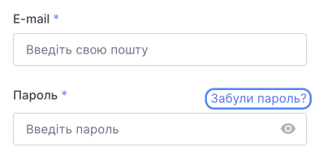

# Відновлення доступу

Якщо у вас виникли проблеми з доступом до облікового запису, ви можете відновити доступ:

- якщо ви є власником облікового запису, ви можете [змінити свій пароль](/ua/control-panel/personal-area/registration-in-the-control-panel#%D1%89%D0%BE%D0%B1-%D0%B7%D0%BC%D1%96%D0%BD%D0%B8%D1%82%D0%B8-%D1%86%D1%8E-%D1%96%D0%BD%D1%84%D0%BE%D1%80%D0%BC%D0%B0%D1%86%D1%96%D1%8E) чи адресу електронної пошти або [вимкнути двоетапну перевірку](##);
- якщо ви не є власником облікового запису, ви можете лише [змінити пароль](/ua/control-panel/personal-area/registration-in-the-control-panel#%D1%89%D0%BE%D0%B1-%D0%B7%D0%BC%D1%96%D0%BD%D0%B8%D1%82%D0%B8-%D1%86%D1%8E-%D1%96%D0%BD%D1%84%D0%BE%D1%80%D0%BC%D0%B0%D1%86%D1%96%D1%8E) самостійно. У разі проблем з електронною поштою та двоетапною перевіркою зв’яжіться з власником облікового запису – він має [видалити вас зі списку користувачів](##) і [додати нового користувача](##) з правильними даними.

## Відновлення паролю

Користувач з будь-якою роллю може змінити пароль.

Якщо ви втратили доступ до електронної адреси, яку використовували для реєстрації, [змініть адресу електронної пошти](/ua/control-panel/personal-area/restoring-access#змінити-адресу-електронної-пошти).

Якщо у вас виникнуть проблеми під час реєстрації, напишіть у службу технічної підтримки: [support@onecloudplanet.com](mailto:support@ocplanet.cloud).

1. На сторінці входу [панелі керування](https://console.ocplanet.cloud/sign-in) натисніть **Забули пароль?**.

2. Введіть адресу електронної пошти, яку ви використовували під час реєстрації.

3. Натисніть **Відновити пароль**.

4. Ми надішлемо лист на вказану електронну адресу. В електронному листі натисніть посилання, яке веде до скидання пароля. Скидання пароля активне протягом 5 хвилин. Ви можете натиснути на посилання для скидання пароля лише один раз.

5. На сторінці скидання пароля введіть новий пароль і підтвердьте його.

6. Натисніть **Змінити пароль**

## Змінити адресу електронної пошти

Якщо ви не є власником облікового запису, зв’яжіться з власником облікового запису – він має [видалити вас зі списку користувачів](##) і [додати нового користувача](##) з правильними даними.

Якщо ви є власником облікового запису, надайте нам такі документи, щоб змінити адресу електронної пошти:

import Tabs from '@theme/Tabs';
import TabItem from '@theme/TabItem';

<Tabs>
  <TabItem value="entity" label="Юридична особа" default>
Підготуйте документи:

- ІПН організації;

- документ, що підтверджує повноваження особи, яка підписала заяву про відновлення доступу (для генерального директора – це копія наказу або рішення про призначення, для інших осіб – довіреність);

- Заява за [шаблоном](./files/restoring-access-for-legal-entities.docx).

Надайте підготовлені документи на електронну пошту support@onecloudplanet.com

Для підвищення безпеки процедури відновлення доступу до облікового запису ми можемо запитати додаткові документи.
  </TabItem>

  <TabItem value="individual" label="Фізична особа">
Підготуйте документи:

- копію головного розвороту паспорта;

- фотографію Власника облікового запису з паспортом, відкритим на головному розвороті;

- Заява за [шаблоном](./files/restoring-access-for-individuals.docx).

Надайте підготовлені документи на електронну пошту support@onecloudplanet.com

Для підвищення безпеки процедури відновлення доступу до облікового запису ми можемо запитати додаткові документи.
  </TabItem>
</Tabs>