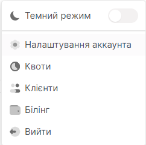
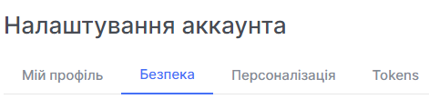
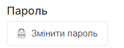
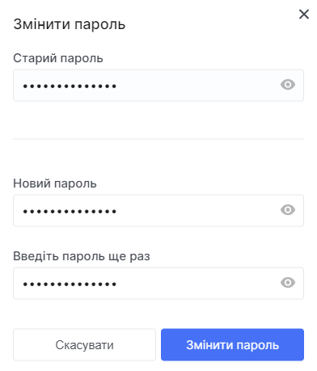
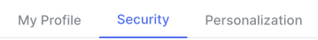
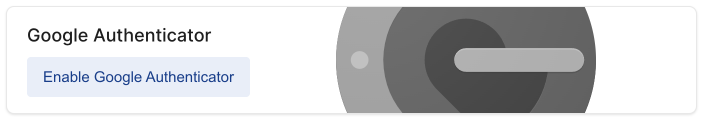
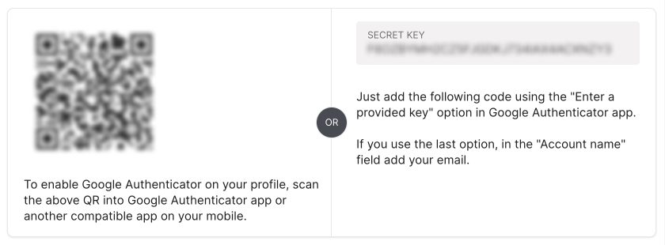
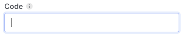
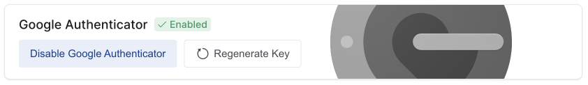

# Безпека

Щоб захистити свій обліковий запис, ви можете:

- [змінити пароль](#змінити-пароль) до облікового запису;
- налаштувати [двохетапну аутентифікацію](#).

## Змінити пароль

Якщо ви забули пароль до свого облікового запису, [відновіть його](./restoring-access#відновлення-паролю).

1. У контрольній панелі відкрийте випадаючий список у верхньому правому куті та виберіть **Налаштування облікового запису**.

2. Перейдіть до розділу **Безпека**.

3. Натисніть **Змінити пароль**

4. Введіть старий пароль, новий пароль та ще раз введіть новий пароль.

5. Натисніть **Зберегти**

## Двоетапна аутентифікація

За допомогою двохетапної аутентифікації вам потрібно ввести пароль і одноразовий код підтвердження для входу в обліковий запис. Двоетапна аутентифікація підключається окремо в особистих налаштуваннях облікового запису.

Ви можете підключити спосіб отримання одноразового коду підтвердження в додатку Google Authenticator.

Тільки власник облікового запису може вимкнути двоетапну аутентифікацію в контрольній панелі та повторно увімкнути її.

Якщо ви втратите доступ до пристрою з додатком аутентифікатора, ви можете звернутися до технічної підтримки для відновлення доступу до вашого облікового запису.

1. У контрольній панелі відкрийте випадаючий список у верхньому правому куті та виберіть **Налаштування облікового запису**.

2. Перейдіть до розділу **Безпека**.

3. Натисніть **Увімкнути Google Authenticator**

4. У вас буде вибір підключення через **QR-код** або можливість самостійно ввести **SECRET KEY** у додатку Google Authenticator.

5. Введіть отриманий код у поле **Код**

> :bulb: Якщо **QR-код** не зчитується або **SECRET KEY** неправильний, натисніть **Оновити ключ** для оновлення. У модальному вікні підтвердіть, що ви згодні з оновленням коду, та натисніть кнопку **Так**.

6. Натисніть **Увімкнути Google Authenticator**

## Вимкнути двоетапну аутентифікацію, якщо у вас є доступ до контрольної панелі

Тільки **власник облікового запису** може вимкнути двоетапну аутентифікацію в контрольній панелі.

1. У контрольній панелі відкрийте випадаючий список у верхньому правому куті та виберіть **Налаштування облікового запису**.

2. Перейдіть до розділу **Безпека**.

3. Натисніть **Вимкнути Google Authenticator**

> :bulb: Якщо ви втратили доступ до додатку Google Authenticator, натисніть **Оновити ключ**, підтвердіть, що ви згодні з оновленням коду, та натисніть кнопку **Так**.

## Вимкнути двоетапну аутентифікацію, якщо немає доступу до контрольної панелі

Якщо ви не є власником облікового запису, зв’яжіться з власником облікового запису - він повинен [видалити вас зі списку користувачів](#) і [додати нового користувача](#) з правильними даними.

Якщо ви є власником облікового запису, будь ласка, зв’яжіться з [технічною підтримкою](#).