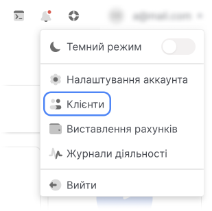
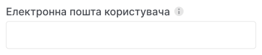
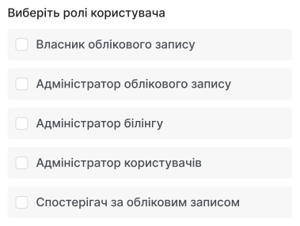
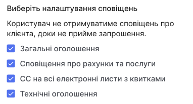
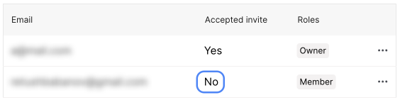

# Додати користувача

Користувачі можуть додаватися [власником облікового запису](#) та [адміністратором користувачів](#).

1. У панелі управління відкрийте випадаючий список у верхньому правому куті та виберіть **Клієнти**.

2. Перейдіть за посиланням **Ваш ID**.

3. Перейдіть на вкладку **Користувачі**.

4. Натисніть **Запросити користувача**.

5. Введіть адресу електронної пошти користувача.

6. Виберіть [ролі користувача](##), їх можна вибрати необмежену кількість.

7. Додатково: виберіть категорії сповіщень, які будуть надіслані користувачеві.

8. Натисніть **Запросити користувача**. Користувача буде додано до списку на вкладці **Користувачі** зі статусом **Запрошення ще не прийнято**.

9. На електронну пошту користувача буде надіслано посилання для [реєстрація за запрошенням](##). Аккаунт активується після підтвердження пошти та завершення реєстрації.