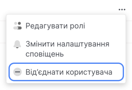
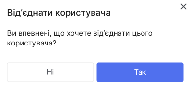

# Від'єднати користувача

Видаляти користувачів можуть **Власник облікового запису** та **Адміністратор користувачів**.

1. У панелі управління відкрийте випадаючий список у верхньому правому куті та виберіть **Клієнти**.

2. Перейдіть за посиланням **Ваш ID**.

3. Перейдіть на вкладку **Користувачі**.

4. У рядку потрібного користувача натисніть кнопку (⋯)

5. Нажміть **Від'єднати користувача**.

6. У модальному вікні, натисніть **Так**.

