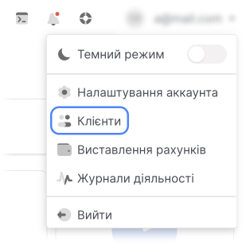
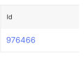
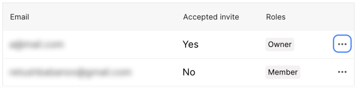
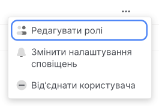
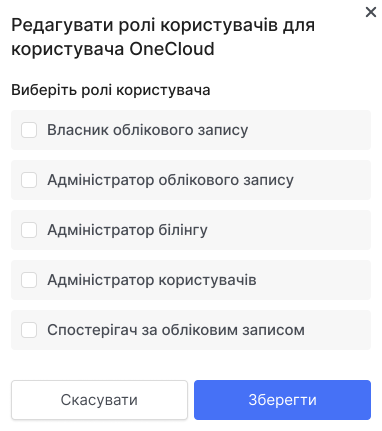
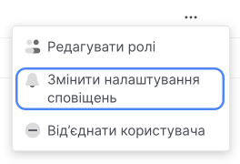
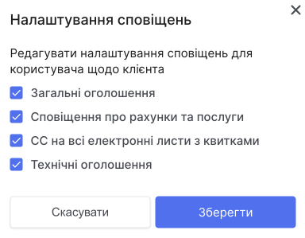

# Редагувати ролі або сповіщення

Змінювати категорії та ролі сповіщень можуть [власник облікового запису](#) та [адміністратор користувачів](#).

Користувачі панелі управління можуть змінювати [категорії сповіщень](##) і не можуть змінювати пошту – вам потрібно створити нового користувача, щоб зв’язати іншу пошту.

Користувачі можуть змінювати роль або додавати додаткові відповідно до [правил суміщення ролей](##). Ви не можете змінити роль власника облікового запису. Адміністратор користувачів не може змінити свою роль, але власник облікового запису або інший адміністратор користувачів може це зробити.

## Редагувати ролі

1. У панелі управління відкрийте випадаючий список у верхньому правому куті та виберіть **Клієнти**.

2. Перейдіть за посиланням **Ваш ID**.

3. Перейдіть на вкладку **Користувачі**.

4. У рядку потрібного користувача натисніть кнопку (⋯)

5. У випадающому списку натисніть **Редагувати ролі**.

6. Зробить потрібні налаштування.

7. Нажміть **Зберегти**.

## Редагувати сповіщення

1. У панелі управління відкрийте випадаючий список у верхньому правому куті та виберіть **Клієнти**.

2. Перейдіть за посиланням **Ваш ID**.

3. Перейдіть на вкладку **Користувачі**.

4. У рядку потрібного користувача натисніть кнопку (⋯)

5. У випадающому списку натисніть **Змінити налаштування сповіщень**.

6. Зробить потрібні налаштування.

7. Нажміть **Зберегти**.