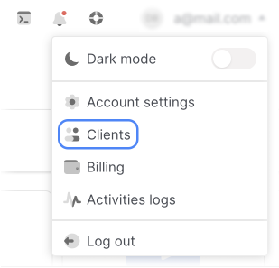
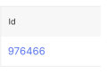
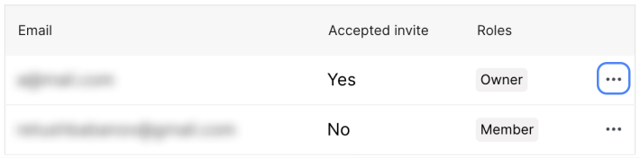
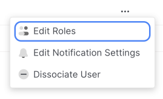
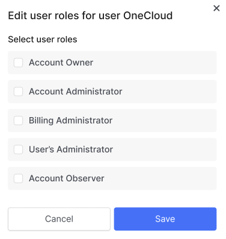
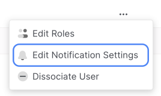
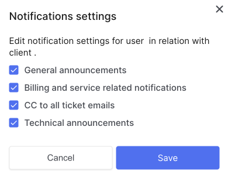

# Edit roles or notifications

Change notification categories and roles can by the Account Owner and User Administrator.

Control panel users can change [notification categories](##) and can't change mail - you need to create a new user to link different mail.

Users can change the role or add additional ones in accordance with the [rules for combining roles](##). You cannot change the role of an Account Owner. The User Administrator cannot change their role, but the Account Owner or another User Administrator can do so.

## Edit Role

1. In the control panel, open the drop-down list in the upper right corner and select Clients.

2. Follow the link **Your ID**.

3. Go to the **Users** tab.

4. In the row of the desired user, press the (⋯) button.

5. In the dropdown list, click **Edit Roles**.

6. Change the desired settings.

7. Click **Save**.

## Edit Notifications

1. In the control panel, open the drop-down list in the upper right corner and select Clients.

2. Follow the link **Your ID**.

3. Go to the **Users** tab.

4. In the row of the desired user, press the (⋯) button.

5. In the dropdown list, click **Edit Notifications Settings**.

6. Change the desired settings.

7. Click **Save**.